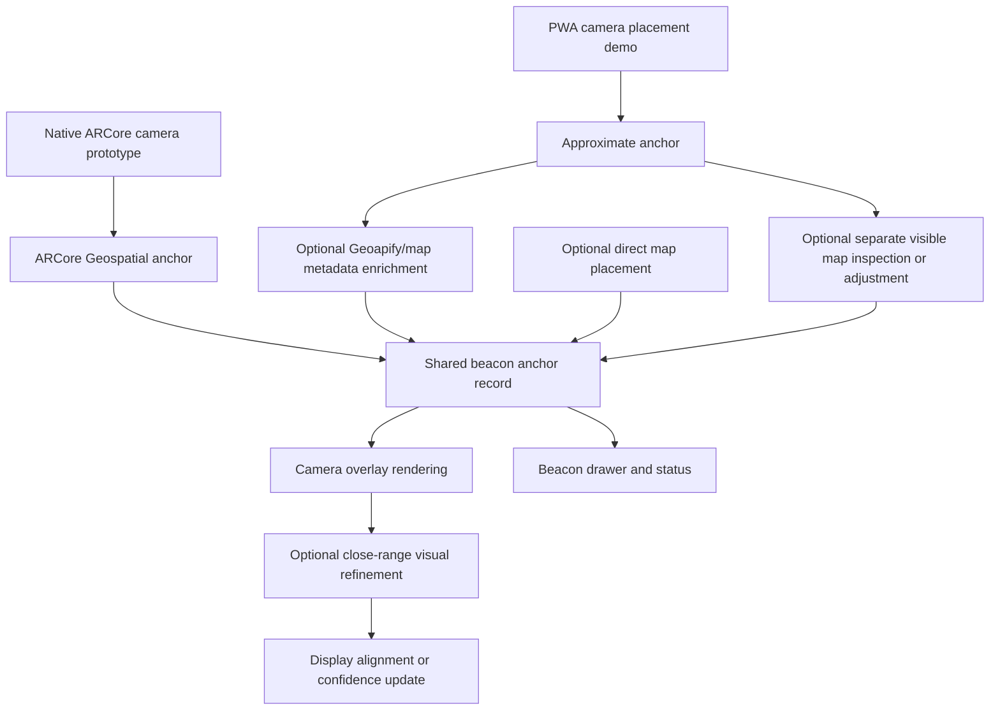

# RFC: Camera-First Geospatial Beacon Anchoring Options

RFC Type: Architecture
Status: Draft
Date: 2026-06-19
Source: `PRD.md`, `SRS.md`, `technical-specification.md`, `specs/RFC-BUG-11-beacon-multiple-placement-jump.md`, user scope correction and clarification on 2026-06-15, provider/system research on 2026-06-16, user clarification on camera-only placement UX on 2026-06-17, user-approved ARCore/PWA dual-track pivot on 2026-06-18, user clarification on skyward beacon columns and obstructed bases on 2026-06-19
Related RFCs: `specs/RFC-BUG-11-beacon-multiple-placement-jump.md`
Related ADRs: None
Owner: Codex
Approvers: Unassigned
Audience: Product owner, future implementation agents, reviewers, QA
Implementation Approval: Required
Repo Root: `C:\Skymark`

## 1. Executive Summary

The existing beacon system is an MVP anchoring model: camera placement stores a coordinate approximately 100 meters ahead of the user's current GPS fix, then the camera overlay renders saved beacons by comparing current heading with the bearing from the latest GPS fix to each saved coordinate. That model is useful for proving the camera-first concept, but it is no longer sufficient for the desired product direction.

The next major product phase should make camera placement accurate by using a real geospatial anchoring system, not only a map-data lookup. The primary user experience should remain camera-only: the user aims through the camera and places a beacon without interacting with a traditional map. A visible map view may still exist later, but it should be treated as a separate feature for inspection, browsing, or manual adjustment rather than the required placement path.

The product concept is a tall beacon pillar, not a flat pin. Each beacon should be understood as a durable ground/base anchor plus a far-rising skyward column. In the long-term target experience, the base may be hidden by terrain, trees, buildings, or other obstructions while the visible upper column still guides the user. Future agents must preserve this model when designing anchor data, overlay rendering, ARCore validation, map support, and obstruction behavior.

The AI agent recommendation is Route E: a dual-track strategy. Keep the existing Next/PWA product as the short-term shareable demo and product-learning surface, while creating a separate Google ARCore Geospatial accuracy prototype as the first serious proof of real camera-based beacon placement. Geoapify remains the recommended low-cost map/location metadata provider for address, place, route, and nearby-context enrichment, but it should not be treated as the primary accuracy system. This RFC does not approve product-code implementation by itself.

## 2. Context

The MVP intentionally avoided map placement, WebXR anchors, automatic distance estimation, backend accounts, and native applications. It prioritized a polished PWA that could place a small number of local beacons quickly through camera, GPS, compass, and `localStorage`.

That boundary is now changing. The product direction is no longer "fix the 100-meter MVP beacon so it jumps less." The product direction is "make beacons tied to the real place the user means through a camera-first experience." That affects product requirements, software requirements, data modeling, UI, geospatial rendering, QA, and likely platform choices.

The important correction is that a normal map provider is not the same as a camera-positioning system. Geoapify, Mapbox, MapTiler, OSM/Overture data, or similar services can describe what is near a coordinate. They cannot by themselves prove what exact real-world point the camera is aiming at. Google ARCore Geospatial is a better first accuracy prototype because it combines GPS, device sensors, Google's Visual Positioning System, and geospatial anchors. It may require a native Android/iOS or Unity prototype rather than a pure PWA implementation, so the PWA should continue in parallel as the fastest demoable product shell.

Current implementation facts:

- Saved beacon records store `latitude`, `longitude`, `placementHeading`, `placementDistanceMeters`, and sensor confidence metadata.
- Camera-created beacons are derived from the current GPS fix, current heading, and a fixed 100-meter placement distance.
- The overlay renders saved beacons from the latest live GPS fix to each saved beacon coordinate.
- There is no map view, map provider, anchor provenance model, or camera recognition pipeline.
- There is no native Android/iOS, Unity, ARCore Geospatial, or ARKit geospatial prototype in this repository.
- Existing specs describe map support mostly as an MVP stretch or future enhancement, which undersells the desired next product phase.

## 3. Problem Statement

Sky Beacon needs a post-MVP anchoring architecture in which beacons stay tied to intended real-world locations, not merely fixed-distance projections from the user's placement heading.

The architecture must answer:

- How the system creates, confirms, or corrects a beacon's real coordinate.
- How the system represents a beacon as a durable base anchor plus skyward column rather than only a flat coordinate marker.
- How camera-created, ARCore geospatial, map-cross-referenced, map-created, map-adjusted, and visually refined anchors share one data model.
- How a real geospatial anchoring route, especially ARCore Geospatial, can support accurate camera-only placement without forcing a visible map UI into the primary flow.
- How the existing PWA can keep demonstrating a similar camera-first experience while native ARCore feasibility is proved separately.
- How the camera overlay renders those anchors without implying false precision.
- How close-range camera recognition can be evaluated without forcing a fragile or privacy-sensitive dependency into the baseline product.
- How future implementation agents verify that `PRD.md` and `SRS.md` still match the intended product direction before coding.

## 4. Decision Scope And Packaging

This is an Architecture RFC with Stage 0 research/routes because the work is broad and not ready for immediate code execution. It defines the recommended product and system direction, affected areas, approval gates, and future implementation phases.

This RFC owns:

- Product-level framing for camera-first geospatial beacon anchoring options.
- The shared anchor model direction: source, confidence, provenance, and refinement history.
- The required PRD/SRS reconciliation gate before implementation.
- The high-level hidden geospatial resolution, optional separate visible map, camera overlay, and visual refinement boundaries.
- The persistence decision framing: local-first saved beacons may remain possible, but backend/service-side processing is likely required for hidden map/geospatial resolution and must be selected explicitly.
- The order in which future implementation RFCs should be written.

This RFC does not own:

- Final map provider selection.
- Final provider/backend architecture for metadata enrichment, hidden map/geospatial resolution, or native ARCore prototype persistence.
- Final native mobile framework choice, including native Android, native iOS, Unity/AR Foundation, React Native, Expo, or another shell.
- Pricing, account, billing, or production map-token decisions.
- Exact UI layout for the map screen.
- Final camera-recognition model or library choice.
- Final persistence architecture, including backend sync, accounts, shared beacons, or social features.
- Product-code implementation.

Separate follow-up RFCs should be created for the ARCore Geospatial prototype, PWA demo enhancements, Geoapify metadata enrichment, implementation phases, visible map as a separate feature if desired, backend/cloud persistence, broader visual-recognition research, and any privacy-sensitive image storage.

### Requirement Vs Candidate Solution Framing

This RFC intentionally separates the product requirement from possible solution paths. Future agents must preserve this distinction when writing follow-up RFCs or implementation plans.

| Layer | Statement | Status In This RFC |
| --- | --- | --- |
| Product requirement | Beacons should be placed accurately through the camera without requiring traditional map interaction in the primary user experience. | In scope and accepted as the product direction for this draft. |
| Architectural requirement | Accurate camera placement needs a real spatial reference system such as ARCore Geospatial/VPS, provider data, backend processing, visual/geospatial reasoning, or a combination of these; browser camera/GPS/compass alone are not sufficient by themselves. | In scope as an architecture constraint. |
| Architectural requirement | Camera placement, hidden cross-reference/resolution, optional separate map UI, persistence, and overlay rendering must use one shared anchor model if implemented. | In scope as an architecture constraint. |
| Selected product direction | A Google ARCore Geospatial prototype should be the first serious accuracy proof, while the PWA continues as a short-term demo/product shell and Geoapify provides low-cost metadata enrichment. | Selected as the primary direction, but not approved for product-code implementation by this RFC. |
| Candidate solution | PWA-only hidden resolver and Geoapify enrichment can improve demo context and explain confidence, but should not be presented as proving true camera anchoring accuracy. | Candidate parallel demo route; useful before native proof is complete. |
| Candidate solution | Visible map UI can let users inspect, browse, or manually adjust anchors as a separate feature. | Candidate separate feature; not part of the required placement flow. |
| Candidate solution | Broader close-range camera recognition or self-built VPS can refine local display alignment or confidence. | Candidate route; research-only until feasibility and privacy are proven. |
| Non-decision | The exact mobile implementation framework and persistence backend for the ARCore prototype. | Not decided; requires follow-up route/implementation RFC. |

Rule for future agents: do not promote a candidate solution into a requirement unless the PRD/SRS are updated and the route-selection RFC explicitly accepts that promotion.

## 5. Goals

- Move post-MVP beacon anchoring from fixed-distance placement toward real geospatial anchors that can be placed and found through the camera.
- Keep the camera-first experience as the primary product surface.
- Let users place accurate beacons through the camera without interacting with a traditional map in the primary placement flow.
- Preserve the long-term visual/spatial model of a durable ground/base anchor with a skyward column that can remain useful when the base is partially obstructed.
- Preserve the PWA as a short-term working product/demo surface instead of abandoning it before native AR evidence exists.
- Prototype Google ARCore Geospatial as the first serious accuracy path for camera-based placement.
- Use Geoapify or an equivalent low-cost provider for metadata enrichment, not as the primary accuracy source.
- Allow camera-created beacons to become draft anchors that can be cross-referenced, confirmed, adjusted, or refined.
- Treat PWA-only map/geospatial resolution as a useful demo and fallback path, not as proof of true precise camera placement.
- Treat visible map placement and adjustment as a separate optional feature, not as the required accuracy mechanism for the core flow.
- Allow any selected map/geospatial anchoring path to render correctly in the camera overlay.
- Track anchor provenance so the app can explain whether a beacon is approximate, ARCore geospatial, map-cross-referenced, map-confirmed, map-adjusted, or visually refined.
- Preserve honest confidence indicators when GPS, compass, map, or visual signals are weak.
- Evaluate close-range camera recognition as a progressive enhancement with privacy and performance review.
- Require future agents to revisit `PRD.md` and `SRS.md` before implementing this major feature.

## 6. Non-Goals

- Do not implement product code from this RFC alone.
- Do not abandon the existing PWA before a separate native/AR prototype proves enough value to justify migration.
- Do not claim the existing PWA can deliver true ARCore-level geospatial anchoring without native/AR platform work.
- Do not treat self-built VPS, SLAM, or custom visual positioning as the first required path.
- Do not silently replace the MVP's local-only privacy posture with backend storage.
- Do not require user accounts or cloud sync for the default local-first map-anchored route; select them only through an explicit persistence decision.
- Do not persist raw camera images without a separate privacy and storage approval.
- Do not require a visible map UI unless further RFC analysis selects it.
- Do not make visible map UI part of the required placement flow; the product remains camera-first.
- Do not claim camera-only browser sensors are sufficient for highly accurate durable placement without map/geospatial, provider, backend, visual-positioning, or equivalent external spatial evidence.
- Do not show precise distance, line-of-sight, or obstruction claims unless the system can validate them.

## 7. Evidence And Source Map

- `PRD.md` - Updated on 2026-06-15 to state that post-MVP anchoring should evaluate map/geospatial cross-reference, optional visible map UI, and close-range visual refinement.
- `SRS.md` - Updated to version 1.2 with post-MVP map cross-reference, optional visible map view, close-range visual refinement, and anchor provenance requirements.
- `technical-specification.md` - Current MVP technical source; still states that map placement and adjustment are excluded from the MVP.
- `specs/SPEC-001-sky-beacon-mvp.md` - Establishes the original MVP implementation plan and local-only camera/geospatial architecture.
- `specs/RFC-BUG-11-beacon-multiple-placement-jump.md` - Narrow tactical RFC for stabilizing saved beacon rendering near a reconstructed placement origin.
- `components/SkyBeaconApp.tsx` - Owns placement draft creation, sensor requests, persistence calls, and app state.
- `components/beacons/BeaconOverlay.tsx` - Currently renders saved beacons by calling `bearingBetween(currentLocation, beaconCoordinate)`.
- `lib/beacons/beacon-types.ts` - Defines `BeaconRecord` and `BeaconDraft`; does not yet include anchor source, provenance, map metadata, or refinement metadata.
- `lib/beacons/beacon-service.ts` - Owns local persistence and validation flow for saved beacon records.
- `lib/geospatial/destination.ts` - Calculates a coordinate from current position, heading, and distance.
- `lib/geospatial/bearing.ts` - Calculates bearing from the user's location to a saved coordinate.
- `lib/geospatial/overlay-position.ts` - Maps bearing difference into camera-overlay position.
- `lib/sensors/use-camera-stream.ts` - Confirms camera access is browser-permission and secure-context dependent, which also constrains future recognition features.
- `package.json` - Confirms this repository is currently a Next.js/PWA application, not a native Android/iOS or Unity AR project.
- https://developers.google.com/ar/develop/geospatial - ARCore Geospatial source checked on 2026-06-18; ARCore uses GPS, device sensors, and Google's VPS to create global-scale geospatial AR experiences.
- https://developers.google.com/ar/develop/unity-arf/geospatial/anchors - ARCore Geospatial anchor source checked on 2026-06-18; WGS84, Terrain, and Rooftop anchors support real-world content placement.
- https://developers.google.com/ar/develop/c/geospatial/check-vps-availability - ARCore VPS availability source checked on 2026-06-18; apps can check whether VPS coverage is available at a location.
- https://developers.google.com/ar/develop/c/geospatial/api-usage-quota - ARCore API quota source checked on 2026-06-18; quotas exist and must be checked before production use.
- https://apidocs.geoapify.com/ - Geoapify API source checked on 2026-06-18 for maps, geocoding, routing, places, boundaries, and batch APIs.
- https://www.geoapify.com/pricing/ - Geoapify pricing source checked on 2026-06-18 for free-tier and credit model.
- https://maplibre.org/ - MapLibre GL JS is an open-source browser map renderer and a likely base for any visible map UI.
- https://www.maptiler.com/cloud/pricing/ - MapTiler Cloud pricing and quota source checked on 2026-06-16 for managed map tiles/search.
- https://docs.maptiler.com/cloud/api/geocoding/ - MapTiler geocoding/search capability source checked on 2026-06-16.
- https://docs.protomaps.com/ - Protomaps/PMTiles source checked on 2026-06-16 for static/self-hosted map tiles.
- https://operations.osmfoundation.org/policies/tiles/ - OpenStreetMap Foundation tile policy source checked on 2026-06-16; public OSM tile servers are not appropriate as production app infrastructure.
- https://operations.osmfoundation.org/policies/nominatim/ - Nominatim policy source checked on 2026-06-16 for public geocoding limits and attribution requirements.
- https://docs.mapbox.com/accounts/guides/pricing/ and https://www.mapbox.com/geocoding - Mapbox pricing/geocoding sources checked on 2026-06-16 for managed commercial alternatives.
- https://mapsplatform.google.com/pricing/ and https://developers.google.com/maps/documentation/tile/get-api-key - Google Maps Platform pricing/key setup sources checked on 2026-06-16 for managed commercial alternatives.
- https://supabase.com/pricing and https://supabase.com/docs/guides/database/extensions/postgis - Supabase pricing and PostGIS support sources checked on 2026-06-16 for backend persistence/geospatial storage.
- https://firebase.google.com/pricing and https://cloud.google.com/firestore/pricing - Firebase/Firestore pricing sources checked on 2026-06-16 for backend sync alternatives.

## 8. Prior Decisions And Retrieval Context

- The MVP is a Next.js App Router PWA with local UI components, TypeScript, DOM/CSS overlays, camera/geolocation/orientation APIs, and browser `localStorage`.
- Map placement is not included in the MVP technical specification.
- WebXR AR anchors are explicitly future-facing and not required for the baseline app.
- ARCore Geospatial is now the recommended first accuracy prototype, but it likely requires a native Android/iOS, Unity/AR Foundation, or similar mobile AR implementation outside the current PWA shape.
- The PWA should remain the short-term demonstration and product-learning surface while ARCore feasibility is tested.
- The current saved beacon limit is 3 active beacons.
- The current MVP uses fixed 100-meter placement distance.
- Existing bug work around beacon jump and drift is tactical stabilization, not the final anchoring architecture.

## 9. Constraints And Invariants

- The camera view must remain usable without a map provider being loaded at all times.
- Map and camera must share one beacon model, not separate records that drift apart.
- Legacy MVP records must remain readable.
- Local-first browser storage remains the easier baseline persistence route unless route selection explicitly approves backend/server-side persistence.
- Backend/server-side persistence, accounts, cloud sync, and shared beacons remain valid future decision paths, but they must be selected deliberately rather than implied by map/geospatial anchoring.
- Camera, GPS, compass, and recognition features require secure browser contexts and explicit permissions.
- Browser PWA sensor accuracy is variable; the app must communicate uncertainty rather than hide it.
- ARCore Geospatial cannot be treated as a drop-in web/PWA backend; it needs platform feasibility work, supported devices, ARCore API setup, and outdoor/manual testing.
- ARCore VPS coverage is location-dependent; the app must check availability and have degraded/fallback states.
- The PWA and any native prototype must share a conceptual beacon/anchor model so lessons transfer across tracks.
- Map provider SDKs may require network access, tokens, style assets, attribution, and usage policy compliance.
- Any visual-recognition feature may be limited by browser APIs, device performance, lighting, motion blur, and privacy constraints.
- Obstruction-aware rendering remains approximate unless a future source of building, terrain, or line-of-sight data is approved.
- Agents must not collapse the product concept into a flat map pin or short screen marker; even approximate routes should preserve the base-plus-column rendering model where practical.

## 10. Assumption Ledger

| Assumption | Confidence | Verification Method | Blocks Recommendation? |
| --- | --- | --- | --- |
| The product owner wants the next major phase to move beyond fixed-distance MVP placement. | High | User scope correction on 2026-06-15 and PRD/SRS updates in this task. | No |
| Browser-only hidden map/geospatial resolution is not sufficient by itself for the user's desired accurate camera placement experience; a stronger spatial reference system such as ARCore Geospatial is the recommended first proof. | High | User clarification on 2026-06-17 and ARCore/PWA pivot on 2026-06-18. | No |
| A visible map view may still become a separate feature for inspection, browsing, or manual adjustment, but it should not be required for core placement. | High | User clarification on 2026-06-17 and future UX review. | No |
| Google ARCore Geospatial is a better first accuracy proof than a PWA-only map provider because it provides VPS-backed geospatial pose and anchors. | High | Official ARCore docs reviewed on 2026-06-18; validate with device prototype. | No |
| The PWA should continue in parallel as a demo/product shell because it is already the working app and can show the intended user experience faster than a native rewrite. | High | Current repo inspection and user confirmation on 2026-06-18. | No |
| Geoapify remains the preferred low-cost metadata provider for nearby places, address, route, and context enrichment, but it does not replace ARCore for camera placement accuracy. | High | Geoapify docs/pricing reviewed on 2026-06-18; validate provider terms before integration. | Yes, for provider implementation. |
| Close-range custom recognition is valuable but too uncertain to make baseline now. | High | Browser/native capability review, prototype, and device testing. | No |
| Existing local beacon records can be upgraded by adding optional provenance fields. | Medium | Inspect `beacon-service` normalization and validation before implementation. | No |
| The 3-beacon limit can remain during the first post-MVP anchoring phase. | Medium | Product review after route selection. | No |
| Local-first browser storage is the easiest initial persistence route, but server-side storage may become appropriate as post-MVP scope grows. | Medium | Route-selection RFC and product/privacy/security review. | Yes, for persistence implementation. |
| Map/geospatial provider terms, pricing, and token handling may affect architecture. | High | Provider-selection RFC using official documentation. | Yes, for provider implementation. |
| Public OpenStreetMap Foundation tiles, Nominatim, and public Overpass services are useful research references but should not become production dependencies for a distributed app. | High | OSMF tile and Nominatim policies checked on 2026-06-16; verify again before provider approval. | Yes, for provider implementation. |
| MapLibre plus MapTiler is likely the fastest low-cost visible-map prototype path if a separate map feature is selected, while Protomaps/PMTiles is the strongest cheap/open-source-leaning static tile path if the user accepts hosting and update responsibility. | Medium | Provider prototype and current pricing/licensing review. | Yes, for visible-map implementation. |
| Supabase/Postgres/PostGIS is the first backend persistence candidate if server-side beacon storage becomes approved, but local-first remains recommended until sync or sharing is a product requirement. | Medium | Persistence route-selection RFC, privacy review, and Supabase plan validation. | Yes, for backend persistence implementation. |

## 11. Stage 0: Research And Route Options

### Option Explanation Requirements

- Each route below explains the user-facing choice and the implementation implications for a future AI agent.
- External systems are treated as separate decisions. A route may be product-appropriate and still be blocked until the user approves provider accounts, tokens, billing, hosting, privacy posture, and maintenance burden.
- Cheap, free-tier, open-source, and self-hosted options are favored when they meet the product need without creating unacceptable reliability, licensing, support, or operational risk.

### External Systems And Provider Options

Pricing, quotas, licensing, and terms below were checked against official sources on 2026-06-16 and updated for ARCore/Geoapify on 2026-06-18. They must be rechecked before any provider is approved or configured.

| Option | Category | User Setup Or Purchase Required | Cost Or License Posture | Why It Fits | Benefits | Drawbacks And Risks | Agent Implementation Notes | Evidence |
| --- | --- | --- | --- | --- | --- | --- | --- | --- |
| No external system; local-first anchor model only | Baseline data model and MVP stabilization | None beyond browser permissions | No provider cost; existing `localStorage` posture | Fits Phase 1 anchor provenance, Route A stabilization, and early route analysis | Cheapest, private by default, keeps app usable offline, no account or token burden | Does not provide map tiles, geocoding, POI/building validation, shared sync, or backend cross-reference | Agents may update types, validation, and local normalization after approval; must not add SDKs, env vars, backend routes, or network calls | `technical-specification.md`, `README.md` |
| Google ARCore Geospatial | Native/mobile geospatial AR, VPS, and geospatial anchors | Google Cloud project/API enablement, ARCore-capable test device, likely Android/iOS/Unity prototype, outdoor test locations | Official docs expose quotas; no normal map-provider per-request price table was identified for the Geospatial API during research, but terms, quotas, supported devices, and related Google services must be rechecked before production | Best first accuracy proof because it is designed to place AR content at real-world geospatial anchors using GPS, device sensors, and Google's VPS | Closest match to camera-first beacon placement; supports WGS84, Terrain, and Rooftop anchors; can check VPS availability; avoids building our own VPS | Not a drop-in PWA backend; requires native/AR implementation; coverage and device support vary; Google dependency; related Google Maps Platform services may cost money; needs manual outdoor QA | Create a separate native/Unity prototype plan before editing the PWA; keep shared anchor model portable; record anchor type, Earth tracking state, VPS availability, confidence, and fallback behavior; do not store camera imagery by default | https://developers.google.com/ar/develop/geospatial, https://developers.google.com/ar/develop/unity-arf/geospatial/anchors, https://developers.google.com/ar/develop/c/geospatial/check-vps-availability, https://developers.google.com/ar/develop/c/geospatial/api-usage-quota |
| Geoapify | Managed map/location metadata provider | Geoapify account, API key, free-tier/credit-limit review, privacy disclosure if coordinates are sent to Geoapify | Free tier and paid plans; current docs use credit-based pricing and must be rechecked before integration | Best low-cost metadata/context provider for the first PWA or backend enrichment route | Geocoding/reverse geocoding, places, routing, map matching-like context via APIs, boundaries, elevation, static maps, and low-cost entry point | Does not provide AR/VPS camera positioning; cannot prove the exact physical point the camera aimed at; provider terms, caching, quota, and key exposure must be reviewed | Use behind a provider adapter; use to enrich ARCore/PWA anchors with nearby place/address/route context; add quota/error states; do not make it the source of placement truth | https://apidocs.geoapify.com/, https://www.geoapify.com/pricing/ |
| MapLibre GL JS plus MapTiler Cloud | Managed visible map, tiles, styles, search/geocoding | MapTiler account, API key, attribution-compliant UI, likely paid plan for commercial or higher usage | MapLibre is open source; MapTiler has a limited free non-commercial plan and paid plans starting at low monthly cost in current pricing | Best low-friction candidate for a visible map prototype because it gives MapLibre-compatible rendering plus managed tiles/search | Fastest path to a polished map; avoids running tile infrastructure; documented MapLibre integration and geocoding/search APIs | Requires public client key handling, quotas, attribution, network availability, vendor terms, and plan verification | Isolate behind `lib/map/map-provider.ts`; use env config only after provider approval; mock map/search in tests; show loading/error/attribution states | https://maplibre.org/, https://www.maptiler.com/cloud/pricing/, https://docs.maptiler.com/maplibre/, https://docs.maptiler.com/cloud/api/geocoding/ |
| MapLibre GL JS plus Protomaps/PMTiles | Static/self-hosted visible map tiles | Host PMTiles on static storage/CDN or bundle a small regional extract; manage updates and attribution | Open-source-leaning/static hosting posture; storage and bandwidth costs depend on hosting | Best cheap/open-source-leaning candidate if avoiding provider subscriptions is more important than managed search/geocoding | No live map API subscription required; works with commodity static hosting; good for bounded regions and predictable demos | Large data files, update burden, attribution/licensing review, no built-in geocoding/search/cross-reference API, and possible bandwidth/storage costs | Add PMTiles/MapLibre protocol only after approval; keep tiles outside app bundle unless region is tiny; document update cadence and fallback | https://docs.protomaps.com/, https://docs.protomaps.com/pmtiles/maplibre |
| Public OSMF tiles, public Nominatim, public Overpass | Public open-data services for research only | No account, but strict policy compliance and attribution | Free public services, not production app infrastructure | Useful for manual research and low-volume internal spikes | Open data ecosystem; good for understanding available map data | Best-effort services, policy/rate limits, potential blocking, no SLA; Nominatim public policy caps heavy use and public OSM tiles are not for heavy distributed app use | Agents must not wire these into production app flows; use only for research or prototype notes unless a separate self-hosted/paid provider is approved | https://operations.osmfoundation.org/policies/tiles/, https://operations.osmfoundation.org/policies/nominatim/, https://dev.overpass-api.de/overpass-doc/en/preface/commons.html |
| Mapbox | Managed maps and geocoding/search | Mapbox account, token, billing, attribution/commercial terms | Pay-as-you-go with free monthly tier; pricing must be checked before approval | Strong commercial option if map UX, geocoding/search quality, or POI data requirements outgrow MapTiler/Protomaps | Mature SDKs/APIs, global data, geocoding/search features, usage dashboard | Vendor lock-in, billing exposure, token management, terms, and possibly more capability than first route needs | Keep behind provider adapter; require cost caps and mocked tests; do not use until provider RFC approves | https://docs.mapbox.com/accounts/guides/pricing/, https://www.mapbox.com/geocoding |
| Google Maps Platform | Managed maps, geocoding, places, tiles, and rich commercial data | Google Cloud project, billing account, restricted API key, enabled APIs, terms review | Pay-as-you-go with some no-cost monthly usage by SKU; billing/key setup required | Strongest candidate if the product later needs Google Places/Roads/Street View-level data or enterprise map coverage | Richest location ecosystem and support path | Highest setup and billing complexity; provider lock-in; EEA terms and API-specific quotas/terms may affect design | Treat as a separate provider RFC; restrict keys; avoid client-only secrets where possible; mock APIs in tests | https://mapsplatform.google.com/pricing/, https://developers.google.com/maps/documentation/tile/get-api-key, https://developers.google.com/maps/documentation/geocoding/usage-and-billing |
| Supabase Postgres/PostGIS | Backend persistence and geospatial storage | Supabase project, database schema, RLS/privacy rules, env vars, possible paid plan | Supabase offers a free plan and paid plans; PostGIS extension is supported | Best first backend candidate if shared/synced beacons, server-side geospatial queries, or user accounts become approved requirements | Postgres/PostGIS fit geospatial data well; cheaper/open-source-leaning managed path; can add auth later | Introduces backend operations, secrets, privacy disclosure, migrations, sync conflict policy, and account decisions | Only after persistence approval; create API/server boundary, migrations, RLS policies, tests, and backout/export plan | https://supabase.com/pricing, https://supabase.com/docs/guides/database/extensions/postgis |
| Firebase/Firestore | Backend sync alternative | Firebase project, security rules, billing beyond free quotas for higher usage | Free quota exists; paid Blaze/GCP billing for larger usage | Candidate if real-time sync and Google ecosystem fit better than relational geospatial queries | Mature realtime client sync and hosting ecosystem | NoSQL data model is less natural for geospatial provenance and PostGIS-style queries; vendor lock-in; billing/security rules complexity | Do not choose as first backend unless realtime sync outweighs geospatial relational needs | https://firebase.google.com/pricing, https://cloud.google.com/firestore/pricing |

### Provider/System Recommendation

For this RFC, choose Google ARCore Geospatial as the first serious accuracy prototype and keep the PWA as the short-term working product/demo surface. Do not yet approve a production provider, backend persistence provider, paid external service, or native framework migration. The next implementation-planning RFC must decide whether the ARCore prototype should be native Android first, Unity/AR Foundation, native iOS later, or another mobile route.

Geoapify remains the recommended first map/location metadata provider because it is low-cost, broad enough for address/place/route/elevation context, and suitable for enriching anchors created by either the PWA or the ARCore prototype. It is not selected as the core accuracy provider because a map/location API cannot by itself know the exact physical point the camera aimed at.

If a visible-map prototype is approved as a separate feature in a follow-up RFC, the AI agent should recommend MapLibre GL JS plus MapTiler Cloud as the first managed prototype path because it is quick to integrate, works with MapLibre, and includes maps plus search/geocoding under one provider account. The strongest cheap/open-source-leaning alternative is MapLibre GL JS plus Protomaps/PMTiles; choose it instead if the user wants to avoid recurring map-provider subscriptions and accepts static hosting, larger data artifacts, and manual update responsibility.

If backend/server-side persistence is approved later, the first backend candidate should be Supabase Postgres with PostGIS because it aligns with geospatial data modeling and keeps an open-source Postgres foundation. Firebase/Firestore should remain a secondary sync-oriented alternative rather than the default because its NoSQL model is less natural for PostGIS-style spatial queries. Public OSMF tile, Nominatim, and Overpass services should not be used as production dependencies.

### Route A: Tactical MVP Stabilization

Human-readable explanation:

- This makes today's camera-created beacons appear less jumpy near the spot where they were placed. It is a short-term stability patch, not a real-world map-backed anchoring system.

Agent implementation implications:

- A future agent should touch only the narrow BUG-11 stabilization surface and tests after implementation approval. This route should not add map providers, backend routes, database schema, subscriptions, tokens, or new persistent anchor provenance unless separately approved.

Summary:

- Implement the narrow BUG-11 render-bearing lock so existing fixed-distance beacons jump less while the user remains near the placement origin.

Benefits:

- Smallest code change.
- Uses existing metadata.
- Helps a visible bug quickly.

Costs:

- Does not move the product to real map/geospatial-backed anchors.
- Reinforces fixed-distance placement as the central model.
- Does not support direct map placement or correction.

Risks:

- Future agents may mistake the tactical fix for the product roadmap.
- Users still cannot select the real-world location they intend.

Validation needs:

- Unit tests for render-bearing lock.
- Manual phone test from same placement spot.

### Route B: Camera-Only UX With Hidden Map/Geospatial Resolution

Human-readable explanation:

- The user places a beacon entirely through the PWA camera. Behind the scenes, the system uses approved map/geospatial data, provider APIs, backend processing, local geospatial datasets, or a combination of these to enrich or sanity-check the intended real-world coordinate without showing a traditional map in the primary flow.

Agent implementation implications:

- A future agent needs a hidden resolver boundary, provider/backend adapter, result types, privacy disclosure, timeout/fallback behavior, confidence rules, and deterministic tests. It must not send coordinates to a third party, add a server route, create provider keys, or auto-apply corrections until the provider/system choice and persistence posture are approved.

Summary:

- Treat PWA camera-created beacons as draft anchors, then cross-reference the draft coordinate against map, geospatial, building, terrain, points-of-interest, or similar spatial data. The result can confirm context, lower confidence, or suggest a correction without requiring visible map UI.

Benefits:

- Preserves the current PWA product shape.
- Improves demo quality, confidence explanations, and metadata while preserving a camera-first interface.
- Keeps the primary user experience free of traditional map interaction.
- Creates a foundation for confidence scoring, backend validation, future map UI, sharing, and route guidance.

Costs:

- May require backend or provider integration.
- Requires provider research, token handling, rate-limit awareness, and possibly network availability.
- Requires migration or compatibility rules for existing local records.
- Does not prove AR/VPS-grade camera placement accuracy.

Risks:

- Provider choice may introduce pricing or policy constraints.
- Suggested corrections can be wrong or ambiguous.
- Backend/service work may exceed the current local-only MVP posture.
- Camera overlay accuracy still depends on GPS and compass quality.
- If the resolver cannot infer the intended point from available evidence, the app must fail honestly instead of pretending the beacon is exact.
- Investors or testers may overestimate accuracy if the UI does not clearly label this as a PWA approximation/demo route.

Validation needs:

- Requirements reconciliation.
- Provider/backend feasibility prototype.
- Data migration tests.
- Tests for confirmed, inconclusive, rejected, and suggested-correction results.
- Manual phone validation.

### Route C: Separate Visible Map Placement And Adjustment Feature

Human-readable explanation:

- The user gets a separate map surface where they can inspect, confirm, drag, or directly place beacon locations. This may be valuable, but it is not the primary placement experience and should not be required for accurate camera placement.

Agent implementation implications:

- A future agent needs a map component, provider adapter, attribution UI, loading/error states, mobile touch QA, provider mocks, and a route back to the camera overlay. It must keep this separate from the core camera placement flow and must not add a map SDK, key, hosted tile source, or paid service until the provider route is approved.

Summary:

- Add a user-facing map view or sheet where users can inspect, place, confirm, or drag beacon anchors outside the core camera placement flow. This can become a full feature if analysis shows user inspection or manual adjustment is valuable.

Benefits:

- Gives users direct control over the intended real-world location.
- Makes corrections inspectable and understandable.
- Creates a clear surface for future route guidance, distance context, and richer geospatial workflows.

Costs:

- Larger UI, interaction, dependency, and QA scope.
- Requires map provider research and possible token/attribution handling.
- Can conflict with the camera-only placement vision if treated as required rather than separate.

Risks:

- Map UI can dilute the instrument feel if not designed carefully.
- Users may expect standard map-app behavior beyond the intended scope.
- Camera overlay accuracy still depends on GPS and compass quality after map placement.

Validation needs:

- Mobile map UX prototype.
- Camera/map cross-render tests.
- Manual phone validation.
- Product review to decide whether visible map is worth the surface area.

### Route D: Native ARCore Geospatial Accuracy Prototype

Human-readable explanation:

- Build a separate native/mobile AR prototype that uses Google ARCore Geospatial. The user still places beacons through the camera, but the accuracy proof comes from ARCore's geospatial pose, VPS availability, and geospatial anchors rather than browser GPS/compass alone.

Agent implementation implications:

- A future agent needs a separate ARCore implementation plan, mobile framework choice, supported-device checks, Google Cloud/API setup instructions, outdoor test plan, fallback behavior, and a bridge back to the shared beacon data model. It must not rewrite the PWA into a native app without explicit approval, and it must not persist raw camera imagery unless a privacy RFC approves it.

Summary:

- Use ARCore Geospatial to prove that Sky Beacon can create and recover real-world camera-placed anchors. Store the result in the same conceptual anchor model so the PWA and native prototype can converge later.

Benefits:

- Closest match to the user's desired accurate camera-only placement experience.
- Uses provider-owned VPS instead of requiring Sky Beacon to train its own VPS.
- Supports real geospatial anchor concepts such as WGS84, Terrain, and Rooftop anchors.
- More compelling as an accuracy proof than a PWA-only map metadata demo.

Costs:

- Requires a mobile AR prototype outside the current Next/PWA app.
- Requires ARCore-capable devices, outdoor testing, Google Cloud/API setup, and likely native Android or Unity/AR Foundation work.
- Still benefits from a map/location metadata provider such as Geoapify for place context, routing, and fallback.

Risks:

- ARCore VPS coverage is location-dependent.
- Platform work may distract from keeping the PWA demo polished.
- Google dependency and related service costs must be monitored.
- It may not cover iOS equally depending on chosen framework and SDK support.

Validation needs:

- Dedicated ARCore route/implementation RFC.
- Device and location compatibility matrix.
- Outdoor anchor placement and re-finding tests.
- VPS availability checks for demo locations.
- Privacy review.
- Performance and battery prototype.

### Route E: Dual-Track PWA Demo Plus ARCore Accuracy Prototype

Human-readable explanation:

- Keep the PWA alive as the fast, shareable product demo while building a separate ARCore Geospatial prototype to prove the real accuracy vision. The PWA can add similar-feeling features such as clearer anchor confidence, provenance, approximate placement, and optional Geoapify metadata, but it should label them honestly as approximate unless ARCore/native evidence is present.
- The selected first implementation slice is the Phased Core PWA Upgrade. The PWA should become a convincing concept demo, not a minimal placeholder: beacons should feel taller, more sky-reaching, more pitch-aware, less like tiny always-visible markers, and more honest about approximate browser placement.

Agent implementation implications:

- A future agent should split implementation planning into two tracks: PWA demo enhancements in this Next app, and a separate native/ARCore prototype plan. Shared types, glossary, confidence states, and anchor provenance should be kept compatible. The first implementation should not abandon the PWA or silently start a native rewrite without a specific approved plan.
- The first PWA implementation spec should include six phased local-PWA workstreams: visual scale/verticality, pitch behavior, conservative base hiding, off-screen guidance, confidence/provenance UI, and backward-compatible anchor model groundwork. It should not add provider SDKs, backend routes, native files, tokens, paid services, or live map calls. Later PWA slices may add map-backed metadata, hidden cross-reference, visible map inspection, or browser-accessible VPS/geospatial AR only after explicit provider/platform approval and current evidence.

Summary:

- Run the PWA and ARCore paths in parallel. The PWA demonstrates the product, narrative, and camera-first interaction quickly. The ARCore prototype demonstrates whether accurate camera anchoring is technically believable. Geoapify can enrich either track with place/map metadata.
- The PWA track should move toward the final product feeling within realistic browser limits while remaining truthful that GPS/compass anchoring is approximate until stronger spatial evidence exists.

Benefits:

- Aligns with the desired final product while preserving a short-term working demo.
- Avoids a drastic native rewrite before the AR accuracy value is proven.
- Gives potential users/investors something tangible sooner.
- Fixes the current PWA's biggest concept-demo weakness: small, fully visible, visually underpowered beacons that do not yet communicate the final skyward marker experience.
- Lets the native prototype focus narrowly on "can accurate camera anchoring work?"
- Keeps Geoapify, map UI, backend persistence, and open-source data as supporting decisions instead of confusing them with the accuracy proof.

Costs:

- Requires two coordinated tracks and careful messaging.
- May duplicate some interaction concepts between PWA and native prototype.
- Requires discipline to keep shared concepts aligned without over-engineering a cross-platform architecture too early.

Risks:

- The PWA can drift into pretending it has accuracy it does not have.
- The PWA can also under-sell the product if its beacons remain too small, flat, or always fully visible.
- The ARCore prototype can become a separate app with incompatible data assumptions.
- Investors may ask whether the native proof is the real product and the PWA is only a mock if the relationship is not explained clearly.

Validation needs:

- PWA beacon demo acceptance criteria for scale, verticality, pitch response, conservative base visibility, off-screen guidance, confidence language, and outdoor readability.
- PWA demo acceptance criteria that are honest about approximate placement.
- ARCore prototype acceptance criteria around anchor placement, recovery, VPS availability, and fallback.
- Shared anchor glossary and data shape.
- Explicit demo script explaining what each track proves.

### Route Decision Matrix

| Criterion | Route A: Tactical Stabilization | Route B: PWA Hidden Metadata/Resolver | Route C: Separate Visible Map | Route D: ARCore Accuracy Prototype | Route E: Dual-Track PWA + ARCore |
| --- | --- | --- | --- | --- | --- |
| Matches updated product direction | Low | Medium | Medium as separate feature | High | High |
| Fixes same-location beacon jump | High | Medium | Medium | Medium | High if Route A is included in PWA track |
| Enables accurate camera placement without map UX | Low | Low to Medium | Low if required, Medium if separate | High where ARCore/VPS works | High because Route D proves accuracy while PWA remains demo |
| Preserves camera-first feel | High | High | Medium | High | High |
| Browser feasibility | High | High | Medium | Low because it is native/AR, not browser-first | High for PWA track, Low for ARCore track |
| Prototype/investor value | Medium | Medium | Medium | High if demo location works | High |
| Privacy risk | Low | Medium | Medium | Medium to High depending on SDK/data flow | Medium |
| Implementation scope | Low | Medium | High | High | Medium to High but split into clearer tracks |
| External setup required | None | Geoapify/provider/API or backend if selected | Map tile/search provider or self-hosted tiles | Google Cloud/API, ARCore-capable device, native/Unity tooling | PWA can start without native setup; ARCore setup required for accuracy proof |
| Testability | High | Medium | Medium | Low to Medium due hardware/manual QA | Medium with separate automated PWA and manual AR tests |
| Recommended now | No as primary path | Yes as PWA support/demo path | No as primary path; possible separate feature | Yes as accuracy proof | Yes as overall strategy |

### Route-Selection Evidence Plan

The follow-up implementation planning should evaluate the dual-track path with explicit evidence instead of intuition. It should not choose a visible map UI only because it is the most tangible demo feature, and it should not abandon the PWA until the ARCore path proves enough value.

| Criterion | Weight | Evidence To Gather | PWA Track Signals | ARCore Track Signals |
| --- | ---: | --- | --- | --- |
| Anchor correctness | 5 | Outdoor placement tests against known locations and repeated re-finding attempts. | PWA honestly shows approximate placement and confidence limits. | ARCore anchors can be placed and recovered with materially better stability than GPS/compass. |
| Camera-first user experience | 5 | Prototype walkthroughs and timing from camera placement to durable saved beacon. | User can understand the intended flow quickly in a shareable browser demo. | User can place and revisit anchors through the camera without traditional map interaction. |
| Investor/demo value | 5 | Demo script with side-by-side claims: what is real, approximate, or proven. | Shows the product concept and UI immediately. | Proves the hardest technical claim in a controlled location. |
| PWA beacon fidelity | 5 | Visual QA and outdoor phone testing for scale, height, pitch behavior, base hiding, and readability. | Beacons feel like skyward columns instead of small flat markers. | ARCore validates whether the same concept can be anchored more accurately. |
| User trust and explainability | 5 | UI review for confidence labels, suggested corrections, and fallback messaging. | Approximate/demo states are not misleading. | VPS unavailable, low confidence, and tracking failures are clear. |
| Privacy and permissions | 4 | Data-flow review for coordinates, provider calls, camera data, and retention. | Browser permissions and optional provider calls are disclosed. | ARCore SDK, camera, location, and sensor permissions are disclosed; no raw imagery is persisted by Sky Beacon without approval. |
| Implementation scope | 4 | Spike estimates by files, dependencies, API surfaces, mobile tooling, and test harness changes. | Enhancements remain inside the existing Next app. | Prototype is narrow enough to avoid becoming a full native rewrite. |
| Runtime reliability | 4 | Slow network, denied permissions, provider errors, unsupported devices, and mobile tests. | PWA degrades to approximate local beacons. | ARCore checks VPS availability and handles unsupported/low-tracking states. |
| Cost and provider constraints | 3 | Current official docs for pricing, quotas, attribution, rate limits, and tokens. | Geoapify/free-tier usage is affordable and optional. | ARCore quotas, setup, and related Google service costs are acceptable for prototype. |
| Persistence posture | 3 | Local-first, backend/server-side, and hybrid cache/server tradeoff review. | Local PWA storage remains safe for demo. | Prototype stores enough anchor metadata to compare against the PWA model. |
| Testability | 3 | Mock strategy for provider results plus manual hardware validation plan. | Provider responses and sensor states can be mocked. | Manual device tests are documented; automated coverage is limited to pure data/model logic. |

Promotion rule:

- Promote the dual-track route if the PWA can remain an honest demo while ARCore can prove materially better placement/recovery in a controlled outdoor test.
- Promote PWA beacon-experience work first if it materially improves the concept demo without adding provider/platform obligations.
- Promote PWA-only hidden metadata/resolution only as a support/demo path, not as the primary accuracy proof.
- Promote ARCore as the primary accuracy path if a small native/Unity prototype proves anchor placement and recovery in the target demo location.
- Promote visible map UI only as a separate feature if user inspection or manual adjustment creates value beyond the camera-only flow.
- Promote a hybrid only if the visible map remains optional and each part has a distinct job.
- Defer provider implementation if provider constraints, privacy risk, or testing gaps make the product less reliable than the MVP.

## 12. AI Agent Recommendation

Choose Route E: Dual-Track PWA Demo Plus ARCore Accuracy Prototype.

The product should not spend the next major effort polishing the MVP's fixed-distance illusion as if it were the final anchoring model, and it should not make traditional map interaction part of the core placement flow. The next durable step is to keep the PWA useful for demonstration while proving the hard technical claim with Google ARCore Geospatial: can a user place and later recover a beacon through the camera with materially better stability than GPS/compass projection?

The first implementation slice should be the Phased Core PWA Upgrade. It should be written as one implementation spec with phased tasks, not as one vague visual polish task. It should focus on a polished, honest, shareable demonstration: taller sky-reaching beacon columns, stronger visual scale, ground/base-oriented placement, pitch-aware behavior, conservative obstruction/base visibility, off-screen guidance, better confidence/provenance language, minimal backward-compatible anchor model groundwork, and approximate placement clarity. In this first PWA slice, ground/base-oriented placement means the user is guided to aim at the intended beacon base or ground target, then preview a skyward column from the approximate browser-derived base anchor; it does not mean the PWA has validated the ground plane, depth, terrain contact point, or line of sight. The selected first-slice confidence behavior is save-with-warning: weak GPS, heading, or orientation confidence should be clearly labeled but should not block approximate placement when required data exists. It should not add provider dependencies, backend routes, native files, or VPS claims. It should also not introduce a full nested anchor object, complete provenance history, mandatory altitude fields, or irreversible schema migration. BUG-11 stabilization should remain separate from this first spec by default because it reinforces the old fixed-distance stabilization model; create a tactical follow-up only if QA shows jump/drift still materially harms the upgraded PWA demo.

After that first slice, the realistic PWA improvement ladder is:

1. Local PWA beacon experience: visual scale, verticality, pitch response, off-screen guidance, conservative obstruction cues, and confidence/provenance language.
2. Local anchor model and rendering contract: start with minimal optional fields and render helpers, then evolve toward richer anchor semantics when future PWA records need to represent camera-created, map-backed, ARCore-derived, map-adjusted, visually refined, altitude-aware, or obstruction-aware anchors.
3. Provider-backed metadata or hidden map/geospatial cross-reference: Geoapify or another approved provider may enrich or sanity-check anchors after current pricing, quota, token, attribution, privacy, and fallback behavior are approved.
4. Optional visible map inspection or placement: a separate feature that can create or adjust anchors, with all map-created beacons still rendered through the camera.
5. AR/depth-based ground placement and browser-accessible precision research: ARCore/native depth, WebXR, browser geospatial AR, depth, visual positioning, or VPS-like capabilities must be explored as future routes for validating the intended beacon base more accurately. Add them only if current platform/provider evidence shows they are realistic for the selected surface; otherwise, ARCore/native remains the accuracy proof.

The ARCore track should focus narrowly on accuracy: VPS availability, geospatial anchor placement, anchor recovery, failure states, and whether the result is compelling enough to justify a later native app investment.

The recommended external-system posture is ARCore Geospatial for the first accuracy prototype and Geoapify for low-cost metadata enrichment. The strongest alternative is a PWA-only hidden Geoapify/map resolver because it is cheaper and faster inside the current repo. It is not selected as the primary accuracy path because it cannot prove exact camera placement. A visible map remains a separate feature and should not be required for the primary placement experience.

## 13. Proposed Architecture

### Anchor Model

Future beacon records should distinguish the durable anchor coordinate from the evidence used to create or refine it.

Candidate fields:

```ts
type BeaconAnchorSource =
  | "camera"
  | "arcore-geospatial"
  | "map-cross-referenced"
  | "map"
  | "map-adjusted"
  | "visual-refined";
type BeaconAnchorConfidence = "high" | "medium" | "low" | "unknown";

interface BeaconAnchorMetadata {
  source: BeaconAnchorSource;
  confidence: BeaconAnchorConfidence;
  confirmedAt?: string;
  crossReferencedAt?: string;
  adjustedAt?: string;
  mapProvider?: string;
  placementOriginLatitude?: number;
  placementOriginLongitude?: number;
  placementHeading?: number;
  placementDistanceMeters?: number;
  locationAccuracyMeters?: number;
  headingAccuracy?: string;
  visualRefinementAt?: string;
  visualRefinementConfidence?: BeaconAnchorConfidence;
  arcoreAnchorType?: "wgs84" | "terrain" | "rooftop";
  vpsAvailability?: "available" | "unavailable" | "unknown";
  geospatialProvider?: string;
  anchorAltitudeMeters?: number;
  beaconVerticalExtentMeters?: number;
  baseVisibility?: "visible" | "obstructed" | "unknown" | "approximated";
  obstructionEvidenceSource?: "none" | "terrain" | "building" | "ar" | "visual" | "manual" | "provider";
}
```

This shape is illustrative, not final. For the first Phased Core PWA Upgrade, agents should prefer minimal optional fields plus a pure render helper over a large schema redesign. A later implementation RFC must decide whether richer anchor data is flattened onto `BeaconRecord`, nested under `anchor`, or versioned as a schema migration. The altitude, vertical-extent, and base-visibility fields are future-facing support for the long-term tall-beacon/obstruction target; they should not be made mandatory for legacy MVP records.

### Core Data Flow

1. Camera draft placement:
   - User aims through the camera at the intended beacon base or ground target.
   - App creates an approximate coordinate using current GPS, heading, and default placement distance.
   - App treats the result as an approximate base anchor for preview/rendering, not as a proven ground-plane or depth measurement.
   - Record source is `camera` and confidence reflects GPS/heading quality.
2. ARCore Geospatial prototype placement:
   - User aims through a native/AR camera prototype.
   - App checks ARCore Geospatial tracking/VPS availability where possible.
   - App creates a WGS84, Terrain, or Rooftop geospatial anchor.
   - Record source is `arcore-geospatial` and confidence reflects ARCore tracking/VPS state plus product-defined thresholds.
   - Provisional future decision: the ARCore/native prototype should require an AR-ready state before saving or labeling a beacon as `AR-anchored`. If tracking, geospatial state, VPS/demo-location readiness, permissions, or confidence thresholds are not met, the prototype should guide the user to move, scan, wait, or try another location. The exact thresholds and whether to offer a separate `Approximate` fallback must be confirmed in the future ARCore implementation spec.
   - Geoapify or another metadata provider may enrich the saved coordinate with nearby place/address/route context, but does not own placement accuracy.
3. Optional PWA map/geospatial cross-reference:
   - The system evaluates the draft coordinate against approved map or geospatial data.
   - Result can confirm the coordinate, lower confidence, or suggest a correction.
   - Record source can become `map-cross-referenced` if the result is accepted under product rules.
4. Optional separate visible map inspection or adjustment:
   - If selected by a future RFC, the user may open the draft anchor on a visible map outside the required placement flow.
   - User confirms or drags the coordinate to the intended real-world location.
   - Record source becomes `map` or `map-adjusted`.
   - Anchor confidence is updated separately from live sensor confidence.
5. Optional direct map placement:
   - If selected by a future RFC, the user creates a beacon from the visible map.
   - The same saved beacon model is used.
   - Camera overlay renders the saved coordinate using the shared geospatial pipeline.
6. Camera rendering:
    - Overlay calculates bearing from current GPS fix to the saved anchor coordinate.
    - UI displays confidence and avoids fake precision.
    - Rendering treats the beacon as a vertical column rising from a base anchor, not merely as a flat coordinate marker.
    - If obstruction evidence is unavailable, the UI must avoid showing a hidden base as definitely visible; the skyward column may be clipped, faded, or implied.
    - Optional future local display correction can apply only after the durable anchor coordinate is resolved.
7. Close-range visual refinement:
   - Recognition may refine the displayed local alignment or confidence.
   - It should not silently rewrite a durable anchor coordinate without a future product rule.

### Component Map

- `components/SkyBeaconApp.tsx` - Will likely need to coordinate anchor source transitions, optional cross-reference results, and any selected post-placement confirmation prompts.
- `components/beacons/BeaconOverlay.tsx` - Should render from resolved beacon anchors, not from MVP-only placement assumptions.
- `components/beacons/BeaconDrawer.tsx` - May expose anchor confidence, cross-reference status, and optional "adjust on map" actions.
- New map/geospatial cross-reference module - Owns provider or backend calls, result classification, confidence mapping, and timeout/fallback behavior.
- New visible map component/module, if selected - Owns map rendering, coordinate picking, drag adjustment, provider attribution, loading/error states, and touch ergonomics.
- `lib/beacons/beacon-types.ts` - Needs anchor source, confidence, and optional provenance/refinement metadata.
- `lib/beacons/beacon-service.ts` - Needs schema normalization and legacy-record compatibility.
- `lib/geospatial/*` - Should continue to own coordinate, bearing, distance, and overlay math as pure helpers.
- New map/geospatial adapter module - Should isolate provider-specific APIs from product logic.
- Future native/ARCore prototype workspace - Should prove geospatial anchor placement and recovery without forcing a rewrite of the existing PWA before the proof is accepted.
- Future Geoapify metadata adapter - Should enrich anchors with nearby place/address/route context without becoming the source of placement truth.
- Future recognition module - Should be isolated behind a capability boundary and must not couple raw camera processing to storage by default.

### Provider Boundary

ARCore prototype planning and Geoapify metadata selection should be the next major decisions before implementation. The curated shortlist in Section 11 is an evidence baseline, not implementation approval.

The current provider/system recommendation is:

- No production provider or backend is approved by this RFC alone.
- Google ARCore Geospatial is the first recommended accuracy prototype, but a follow-up implementation RFC must choose native Android, Unity/AR Foundation, iOS, or another mobile route before product-code implementation.
- Geoapify is the first recommended metadata/context provider, but it still requires provider setup, privacy, budget, quota, and token-handling approval before integration.
- PWA-only hidden map/geospatial resolution may proceed only as a demo/support route and must not be described as proven accurate camera anchoring.
- MapLibre GL JS plus MapTiler Cloud as the first managed visible-map prototype candidate only if the user approves a separate map feature.
- MapLibre GL JS plus Protomaps/PMTiles as the first cheap/open-source-leaning visible-map candidate only if the user accepts static tile hosting and update responsibility for a separate map feature.
- Supabase Postgres/PostGIS as the first backend persistence candidate only if backend/server-side persistence, sync, or sharing is approved.
- Public OSMF tiles, public Nominatim, and public Overpass services as research references only, not production dependencies.

The follow-up provider RFC must re-check official documentation and answer:

- Licensing and attribution requirements.
- Token, API key, Google Cloud project, and environment variable handling.
- Offline or poor-network behavior.
- Mobile performance, native tooling, ARCore-capable device access, and bundle/app size.
- Cross-reference data needs such as roads, buildings, terrain, points of interest, geocoding, or search.
- Whether the route needs ARCore Geospatial anchors, VPS availability checks, ray casting, feature matching, POI/building snapping, terrain/building intersection, user confirmation prompts, or a manual fallback.
- Cost and rate limits for expected usage.
- Whether self-hosted tiles or datasets are relevant or out of scope.
- Whether a visible map SDK is needed, or whether backend/provider APIs are enough for the selected route.
- How the product remains usable when hidden resolution is inconclusive, unavailable, or low confidence.
- What budget threshold, free-tier limit, or paid-plan trigger requires the agent to stop and ask the user.

### Persistence Boundary

Persistence selection should be treated as a route-selection dimension, not as a side effect of anchoring work.

The easiest initial route is local-first browser storage because it preserves the current app shape and avoids accounts, backend persistence, sync conflicts, and privacy expansion. A later route may select backend/server-side persistence, hybrid local cache plus server persistence, accounts, cloud sync, or shared beacons, but that selection must answer:

- Which beacon fields are stored locally, remotely, or both.
- Whether user identity, accounts, or anonymous device identifiers are required.
- How conflicts are resolved when local and server records disagree.
- How deletion, clear-all, export, and recovery behave.
- What user-facing disclosure is required before transmitting coordinates.
- How the camera view behaves offline or when sync fails.

### Visual Recognition Boundary

Close-range recognition should be treated as a capability with a separate research RFC. That RFC must answer:

- What the app is trying to recognize: beacon-like visual artifacts, landmarks, user-marked points, image features, QR-style fiducials, or scene geometry.
- Whether recognition runs fully on device.
- Whether images, descriptors, or embeddings are stored.
- What user consent and privacy messaging are required.
- What happens on unsupported browsers.
- What confidence threshold allows UI changes.
- Whether recognition can update durable coordinates or only local display alignment.

## 14. System Impact Map

Product:

- PRD and SRS must remain aligned with camera-first geospatial anchoring options before implementation begins.
- MVP acceptance criteria should not be confused with post-MVP product acceptance.

Data:

- Beacon records need anchor source and confidence metadata.
- Legacy records need safe defaults.
- Future schema versioning may be useful even for local storage.

UI:

- Camera-first flow stays primary.
- Visible map UI remains optional until route selection.
- Drawer and selected-beacon controls may need cross-reference status, "confirm on map", or "adjust on map" depending on the selected route.
- Confidence/status UI must distinguish sensor confidence from anchor confidence.
- The selected confidence/status vocabulary uses plain source labels plus separate confidence levels. Source labels include `Approximate`, `Map-backed`, `Map-confirmed`, `AR-anchored`, and `Visually refined`; confidence levels include `High`, `Medium`, `Low`, and `Unknown`.
- Camera-view confidence/status presentation must remain uncluttered. Full source/confidence text should appear only for the selected beacon, brief warnings/status affordances, or drawer/selected-beacon controls; do not add persistent labels to every beacon.
- The PWA UI must clearly distinguish approximate/demo placement from ARCore-proven geospatial anchor placement.
- Beacon rendering must preserve the durable base anchor plus tall skyward column model, including partial base obstruction where supported or conservatively approximated.
- The selected base-visibility vocabulary is `Visible`, `Obstructed`, `Unknown`, and `Approximated` in UI copy, backed by data values `visible`, `obstructed`, `unknown`, and `approximated`. `Unknown` means evidence is missing; `Approximated` means the system is making a conservative estimate without validated obstruction evidence.
- First-slice PWA placement is ground/base-oriented but approximate: the user aims at the intended base, and the app previews the column from a browser-derived base anchor without claiming validated ground-plane or depth accuracy.
- First-slice PWA weak-confidence behavior is save-with-warning. Weak sensor confidence should alter warning/status/visual treatment and persisted confidence metadata, but should not block saving unless required location or heading data is unavailable or unusable.
- Pitch-aware rendering must be relative to the estimated camera frame: heading determines whether the beacon is horizontally in view, pitch determines which vertical segment is visible, and the off-screen indicator is used when no beacon segment intersects the current view.
- The beacon base should appear only when the estimated camera frame includes the base and conservative obstruction rules allow it; looking straight ahead must not automatically show the base.
- When pitch data is unavailable, noisy, or unsupported, the PWA should use a stable heading-only fallback that avoids fake vertical precision and avoids definite base visibility.

Platform:

- The existing Next/PWA app remains the short-term demo/product shell.
- A native/Unity/ARCore prototype may be created separately only after implementation approval.
- Future convergence between PWA and native app requires a separate platform decision.

Geospatial:

- Camera-created, ARCore-created, map-cross-referenced, map-created, and map-adjusted anchors must use compatible coordinate semantics and rendering rules.
- Distance display remains approximate unless validated.
- Obstruction handling remains conservative.
- Future geospatial or AR routes may need altitude, terrain, building, rooftop, or line-of-sight evidence to decide whether the beacon base is visible, hidden, clipped, or only implied.

Sensors:

- GPS and compass remain required for camera overlay direction.
- Backend/service-side cross-reference and visible map placement can work without camera if selected.
- ARCore Geospatial requires camera, location, device sensors, supported devices, and native/AR SDK constraints.
- Custom recognition requires camera and may require secure context, lighting, and device performance gates.

Persistence:

- Baseline remains local storage unless a later RFC approves backend sync.
- Migration must preserve existing beacons.

Testing:

- Unit tests for schema normalization and geospatial helpers.
- Component tests for cross-reference and optional map/camera state transitions where practical.
- E2E tests for selected anchoring flows if provider or map behavior can be mocked.
- Manual outdoor device testing remains required for sensor behavior.
- ARCore prototype validation requires manual outdoor testing on supported devices and selected demo locations.

## 15. Companion Technical Specification

This RFC is intentionally a high-level concept and route-framing document. It should be used to decide what problem the product is solving, what candidate solution paths deserve evidence, and what approval gates must exist before implementation.

Detailed file-level implementation guidance belongs in a companion technical specification:

- `specs/SPEC-003-map-backed-beacon-anchoring-technical-plan.md`
- `specs/SPEC-004-phased-core-pwa-upgrade-implementation-spec.md`

Those specifications should guide future AI implementation agents after a route-selection RFC or explicit user approval chooses one of the candidate paths. They may name files, modules, phases, tests, stop conditions, and validation commands. This RFC should not carry that level of execution detail.

The intended document stack is:

1. `PRD.md` and `SRS.md` define product and software requirements.
2. This RFC defines the concept, candidate routes, route-selection evidence, boundaries, and approval gates.
3. `specs/SPEC-003-map-backed-beacon-anchoring-technical-plan.md` defines conditional technical implementation guidance.
4. `specs/SPEC-004-phased-core-pwa-upgrade-implementation-spec.md` defines the first local-PWA implementation spec for the selected Phased Core PWA Upgrade.
5. A future explicit implementation approval selects the approved path before product code changes.

## 16. Concept-Level Validation Strategy

This RFC is complete when it is clear enough for product and engineering review. It does not need to prove implementation correctness. It should prove that future implementers can answer:

- What requirement is being served.
- Which ideas are candidate solution paths rather than requirements.
- What evidence would promote, reject, or defer each route.
- Which systems are likely affected.
- Which choices require separate approval before implementation.

Validation for this concept document:

- Review `PRD.md` and `SRS.md` for alignment with the requirement-vs-candidate-solution framing.
- Confirm the companion technical spec exists and points back to this RFC.
- Confirm no product code implementation is authorized by this RFC alone.
- Confirm route-selection, provider, privacy, schema, and implementation approvals are separate gates.

## 17. Concept-Level Rollout, Migration, And Backout Considerations

Rollout:

- This RFC can be accepted as product and architecture direction without selecting a technical route.
- Product-code rollout begins only after a future route-selection or implementation RFC is accepted.
- The PWA may continue to ship demo improvements while the ARCore prototype is validated, provided those improvements do not claim ARCore-level accuracy.

Migration:

- This RFC does not require data migration.
- Any future migration for anchor provenance or provider-backed data must be specified in the companion technical spec and approved implementation RFC.

Backout:

- Reverting this RFC as a concept decision should leave product code untouched.
- If future evidence rejects all candidate routes, keep the MVP anchoring model and treat this RFC as superseded or deferred.

## 18. Risks And Mitigations

| Risk | Impact | Mitigation |
| --- | --- | --- |
| Map/geospatial work expands into backend, search, routing, and sharing | Scope becomes unbounded | Keep first selected route focused on anchor confirmation or correction |
| Provider choice adds cost or compliance burden | Deployment or demo blocked | Require provider RFC with official documentation before implementation |
| Native ARCore prototype becomes an unplanned rewrite | PWA progress stalls and scope expands | Keep ARCore in a separate proof-of-accuracy track until platform migration is explicitly approved |
| PWA demo overpromises accuracy | User or investor trust is damaged | Label PWA placement as approximate unless backed by ARCore/native evidence |
| ARCore VPS coverage is unavailable in demo locations | Accuracy proof fails or becomes inconsistent | Check VPS availability before selecting demo sites and define fallback behavior |
| Backend/service cross-reference silently moves anchors incorrectly | User loses trust | Treat corrections as suggestions unless a future product rule explicitly approves auto-application |
| Visible map UI dilutes camera-first identity | Product feels like a generic map app | Keep visible map optional until evidence supports it; keep it as a precision tool if selected |
| Existing beacons become invalid after schema change | User loses local markers | Add legacy defaults and normalization tests |
| Camera overlay still appears inaccurate despite cross-reference or map coordinates | User loses trust | Show honest confidence, continue sensor smoothing, and validate outdoors |
| Agents implement beacons as flat pins or draw bases through obstructions | Product concept becomes misleading | Preserve the base-plus-column model and require conservative base visibility when obstruction evidence is missing |
| Visual recognition proves unreliable | Wasted effort or misleading UI | Treat recognition as research-only until proven; keep fallback behavior |
| Raw camera data creates privacy risk | User trust and compliance risk | Forbid image persistence without separate privacy approval |

## 19. Approval Gates

- Draft review may refine requirements, route choices, and affected systems without approving implementation.
- Product owner must approve the move from MVP stabilization to post-MVP anchoring architecture.
- ARCore Geospatial prototype implementation must be approved before adding native/Unity/mobile project files, Google Cloud/API setup, ARCore SDK dependencies, or ARCore-specific persistence fields.
- PWA demo enhancement implementation must be approved before modifying product code, and must preserve honest approximate/confidence messaging.
- Geoapify metadata provider selection must be approved before adding provider calls, API keys, token handling, quota behavior, or third-party coordinate transmission.
- Hidden geospatial resolution route selection must be approved before implementation chooses additional provider APIs, backend/service cross-reference, self-hosted geospatial data, visual-positioning dependencies, or hybrid resolver behavior.
- Visible map UI must be approved as a separate feature before implementation adds map screens, map sheets, or map-first placement flows.
- Persistence route selection must be approved before implementation introduces backend/server-side storage, accounts, cloud sync, shared beacons, or a hybrid local/server model.
- Provider selection must be approved in a separate RFC before adding provider SDKs, backend calls, tokens, paid services, or attribution-dependent UI.
- Data model changes must be approved before modifying `BeaconRecord` persistence.
- Visual recognition requires a separate research/privacy RFC before implementation.
- Implementation may proceed only after an accepted implementation RFC or explicit user approval in the active task.

## 20. Approval And Amendment Rules

Approvers are currently unassigned. Until this RFC is accepted, future agents must treat it as proposed direction.

Agents may update wording, add evidence, or split follow-up RFCs. Agents must create an Amendment RFC or return for approval before:

- Adding a map/geospatial dependency, backend provider call, or provider token.
- Adding ARCore SDK dependencies, native/Unity project files, Google Cloud/API configuration, or ARCore-specific runtime behavior.
- Replacing the PWA with a native app instead of running an approved separate prototype.
- Changing saved beacon schema.
- Introducing backend/server-side persistence, accounts, cloud sync, shared beacons, or a hybrid local/server persistence model.
- Persisting images or image-derived descriptors.
- Making visual recognition baseline behavior.
- Changing the beacon limit.
- Removing camera-first placement.
- Making traditional map interaction required for accurate placement.
- Treating BUG-11 tactical stabilization as the primary long-term solution.

## 21. Acceptance Criteria

- [ ] The PRD and SRS explicitly distinguish ARCore/geospatial anchoring, PWA-only hidden map/geospatial enrichment, and optional visible map UI.
- [ ] The RFC states that accurate camera-only placement is the primary product goal.
- [ ] The RFC states that the beacon concept is a durable ground/base anchor plus a tall skyward column, including long-term support for partially obstructed bases.
- [ ] The RFC recommends a dual-track strategy: preserve the PWA demo while prototyping Google ARCore Geospatial for the accuracy proof.
- [ ] The RFC records the selected first implementation slice as the Phased Core PWA Upgrade.
- [ ] The RFC states that the first implementation spec should include ground/base-oriented approximate placement, visual scale/verticality, pitch behavior, conservative base hiding, off-screen guidance, confidence/provenance UI, and backward-compatible anchor model groundwork as phased tasks.
- [ ] The RFC outlines a realistic future PWA improvement ladder covering local visual upgrades, anchor model groundwork, map-backed metadata/cross-reference, optional visible map, and browser-accessible precision research.
- [ ] The RFC explains that Geoapify is a metadata/context provider, not the primary camera-placement accuracy system.
- [ ] The RFC requires a PRD/SRS reconciliation gate before implementation.
- [ ] The RFC identifies camera-created, ARCore geospatial, map-cross-referenced, map-created, map-adjusted, and visually refined anchors as distinct sources.
- [ ] The RFC keeps camera recognition as a progressive enhancement pending research and privacy review.
- [ ] The RFC names affected systems across data, UI, geospatial math, sensors, persistence, testing, and rollout.
- [ ] The RFC separates architecture direction from implementation approval.
- [ ] Follow-up RFCs are clearly identified for hidden resolver provider selection, data model changes, selected implementation, overlay integration, separate visible map feature, and visual-recognition research.
- [ ] The RFC explicitly separates product requirements from candidate solution paths.
- [ ] The RFC defines evidence that would promote hidden geospatial resolution approaches, separate visible map feature work, visual refinement, or deferral.
- [ ] The RFC explains route options in both human-readable and AI-agent implementation terms.
- [ ] The RFC includes a curated external system/provider shortlist with cheap/open-source-leaning options and clear drawbacks.
- [ ] The RFC states the AI agent's recommended overall option and external-system posture.
- [ ] The RFC points detailed implementation guidance to `specs/SPEC-003-map-backed-beacon-anchoring-technical-plan.md`.

## 22. Concept Document Handling Contract

### Preconditions

- Work from repo root `C:\Skymark`.
- Read this RFC, `PRD.md`, `SRS.md`, `technical-specification.md`, `specs/SPEC-003-map-backed-beacon-anchoring-technical-plan.md`, and `specs/RFC-BUG-11-beacon-multiple-placement-jump.md`.
- Confirm whether the user is asking for concept/RFC updates, technical-spec updates, route selection, or product-code implementation.

### Approved Scope

- From this RFC alone, agents may update planning documents and create follow-up RFCs.
- Agents may not implement product code from this RFC alone.
- Agents should use `specs/SPEC-003-map-backed-beacon-anchoring-technical-plan.md` for implementation-shaped guidance only after route selection or explicit implementation approval.
- The next selected artifact is an implementation spec only for the Phased Core PWA Upgrade; generating that artifact must not modify product code, tests, dependencies, provider configuration, native files, backend routes, or runtime behavior.

### Related Documents

- `PRD.md` - Product source of truth for map/geospatial anchoring options.
- `SRS.md` - Requirement source of truth for acceptance criteria.
- `technical-specification.md` - Needs a post-MVP supplement or update before implementation.
- `specs/SPEC-003-map-backed-beacon-anchoring-technical-plan.md` - Detailed technical guidance for future implementation agents.
- `specs/SPEC-004-phased-core-pwa-upgrade-implementation-spec.md` - First implementation spec for the local Phased Core PWA Upgrade.
- `specs/RFC-BUG-11-beacon-multiple-placement-jump.md` - Tactical fixed-distance stabilization RFC.

### Forbidden Changes From This RFC Alone

- Do not add dependencies.
- Do not edit product code.
- Do not change localStorage schema.
- Do not add provider tokens, backend calls, or environment variables.
- Do not add native/Unity/ARCore project files or Google Cloud/API configuration.
- Do not introduce backend/server-side persistence, accounts, cloud sync, or shared beacons.
- Do not implement camera recognition.
- Do not persist raw camera images.
- Do not replace the camera-first flow with a map-first flow.
- Do not treat the companion technical spec as implementation approval.

### Validation Commands For Documentation-Only Work

```powershell
git diff -- PRD.md SRS.md specs/RFC-map-anchored-beacon-system.md specs/SPEC-003-map-backed-beacon-anchoring-technical-plan.md specs/SPEC-004-phased-core-pwa-upgrade-implementation-spec.md specs/RFC-BUG-11-beacon-multiple-placement-jump.md
git status --short
```

Expected result:

- The diff/status shows requirements and RFC/spec updates only.
- No product code changes are present.

### Stop Conditions

- Stop if the requested implementation scope conflicts with `PRD.md` or `SRS.md`.
- Stop if provider, backend, ARCore, or native route selection requires current pricing, quota, account, token, licensing, supported-device, or privacy decisions that have not been researched.
- Stop if the user asks to add MapTiler, Protomaps, Mapbox, Google Maps Platform, Supabase, Firebase, public OSM services, or another provider without approving the provider/system posture, setup burden, cost posture, attribution/licensing requirements, and privacy implications.
- Stop if visual recognition would persist images or descriptors without privacy approval.
- Stop if implementation requires backend/server-side persistence, accounts, cloud sync, or shared beacons not approved by route selection or a separate RFC.

### Amendment Triggers

- Provider/backend constraints invalidate the recommended architecture.
- ARCore device/coverage constraints invalidate the recommended accuracy prototype.
- Browser testing proves selected anchor sources cannot render reliably in the camera overlay.
- Product owner decides post-MVP anchoring should not be the next major phase.
- Visual recognition becomes a required baseline feature.
- Data model changes require irreversible migration.

### Handoff Notes

- Treat `specs/RFC-BUG-11-beacon-multiple-placement-jump.md` as a tactical stabilization proposal, not the product roadmap.
- Start implementation planning with Phase 0 PRD/SRS reconciliation.
- Use official provider documentation when choosing map/geospatial technology and re-check pricing/terms on the day of provider approval.
- Treat ARCore Geospatial as the first accuracy prototype and the PWA as the short-term demo surface unless a later accepted RFC supersedes this route.
- Keep Geoapify in the metadata/context layer unless a later provider RFC gives it a different role.
- Prefer cheap, free-tier, open-source, or self-hosted options when they satisfy the route without unacceptable reliability, policy, or maintenance risk.
- Do not use public OSMF tiles, public Nominatim, or public Overpass services as production app dependencies.
- Do not assume visible map UI is required unless a follow-up RFC selects it.
- Keep camera recognition separate until privacy, performance, and fallback behavior are proven.

## 23. ADR Follow-Up

- If accepted, create an ADR recording that post-MVP Sky Beacon follows a dual-track strategy: PWA demo/product shell plus ARCore Geospatial accuracy prototype.
- Create an ADR recording that shared anchor provenance must support camera-created, ARCore geospatial, map-cross-referenced, optional map-confirmed, and visually refined beacons.
- Create a separate ADR after native/mobile route, metadata provider, and persistence decisions are accepted.
- Create a separate ADR if visual refinement is approved as a product capability.

## 24. Open Questions

- Should the ARCore accuracy prototype start as native Android, Unity/AR Foundation, native iOS, or another mobile route?
- Which physical demo locations should be used to validate ARCore VPS availability, anchor placement, and anchor recovery?
- What PWA demo improvements should happen in parallel: BUG-11 stabilization, anchor provenance/confidence UI, Geoapify metadata enrichment, demo script polish, or none until ARCore is tested?
- After the Phased Core PWA Upgrade, does QA show enough jump/drift in the approximate browser placement model to justify a separate tactical BUG-11 follow-up?
- Confirm the provisional ARCore/native fallback rule before implementation: require AR-ready state before saving an `AR-anchored` beacon, guide the user to move/scan/wait/try another location when unavailable, and decide exact thresholds plus whether a separate `Approximate` fallback is allowed.
- What monthly budget, usage volume, region, commercial/non-commercial status, and willingness to self-host should govern Geoapify and any future metadata/map provider selection?
- Should the first post-MVP route stay local-first, introduce backend/server-side persistence, or use a hybrid local cache plus server persistence model?
- If backend persistence is selected, is Supabase/Postgres/PostGIS acceptable as the first candidate, or should Firebase, Neon, self-hosted Postgres/PostGIS, or another system be researched?
- Should visible map UI be deferred entirely for now or tracked as a separate future feature?
- Should the 3-beacon limit remain during the first PWA demo and ARCore prototype phases?
- Should anchor provenance be flattened on `BeaconRecord` or nested under an `anchor` object?
- Which future route should first validate obstruction-aware base visibility and AR/depth-based ground placement: ARCore depth/occlusion, building and terrain data, visual recognition, manual map confirmation, browser-accessible depth/geospatial AR, or staged conservative approximation?
- What exactly should custom close-range recognition recognize, and should it wait until after ARCore evidence exists?
- Should `technical-specification.md` be updated directly or superseded by a post-MVP technical specification?

## 25. Appendix

### A. Relationship To BUG-11

BUG-11 correctly diagnoses why fixed-distance beacons can jump when GPS refreshes during multi-placement flows. Its proposed render-bearing lock may still be useful if the current MVP needs a fast stabilization patch.

However, BUG-11 does not solve the updated product problem. A beacon can be visually stable and still be anchored to the wrong place. The first Phased Core PWA Upgrade should not include BUG-11 by default; treat it as a separate tactical follow-up only if QA shows jump/drift still materially harms the upgraded PWA demo.

### B. Requirement Reconciliation Checklist

Future agents must complete this checklist before code changes:

- [ ] `PRD.md` says post-MVP anchoring may use map/geospatial cross-reference and may include visible map UI if selected.
- [ ] `PRD.md` and `SRS.md` state that ARCore Geospatial or another real spatial anchoring system is the recommended accuracy proof, while the PWA remains the short-term demo/product shell.
- [ ] `SRS.md` includes requirements for ARCore/geospatial anchors, map-backed metadata, optional visible map UI, map cross-reference, close-range visual refinement, and anchor provenance.
- [ ] `technical-specification.md` has either been updated or explicitly superseded for the post-MVP anchoring phase.
- [ ] The implementation plan names whether it is addressing PWA demo improvements, ARCore prototype work, tactical BUG-11 stabilization, Geoapify metadata enrichment, backend/service-side cross-reference, visible map UI, hybrid anchoring, or visual refinement.
- [ ] The implementation plan states whether visual recognition is included, researched, or explicitly deferred.

### C. Mermaid Data Flow


