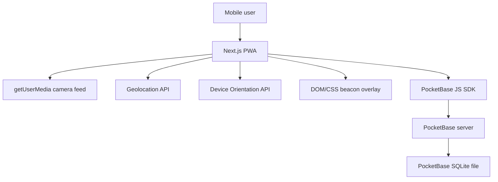

# Technical Specification: Sky Beacon Camera App

Version: 1.0  
Date: 2026-06-10  
Sources: [PRD.md](PRD.md), [SRS.md](SRS.md), [UI.html](UI.html)

## 1. Purpose

This document defines the implementation architecture for Sky Beacon, a mobile-first PWA that lets users preview the real world through their camera and place GPS-backed sky beacons approximately 100 meters ahead of their current position.

The implementation must prioritize a polished, reliable MVP over high-risk AR features. The app uses browser camera, geolocation, and orientation APIs, renders beacons as a DOM/CSS overlay, and persists authenticated user beacons in PocketBase, which provides SQLite-backed storage.

## 2. Locked Technical Decisions

| Area | Decision |
| --- | --- |
| Web framework | Next.js App Router with TypeScript |
| Styling | Tailwind CSS, shadcn/ui, lucide-react |
| Backend | PocketBase |
| Database | PocketBase-managed SQLite file |
| Auth | PocketBase email/password auth only |
| Beacon persistence | PocketBase collections, scoped to authenticated users |
| Guest behavior | Users may preview the camera before sign-in; sign-in is required to save beacons |
| PWA strategy | Installable PWA with cached app shell; network required for auth and beacon saves |
| Map | Not included in MVP |
| WebXR | Roadmap only, no MVP dependency |
| Beacon rendering | DOM/CSS overlay above the camera video feed |
| Desktop | Responsive fallback, not the full desktop console |
| Distance display | No precise distance values in the camera overlay |
| Testing | Unit tests, Playwright desktop E2E, and manual Android Chrome device testing |

Earlier Drizzle/better-sqlite3 discussion is superseded by the PocketBase decision. PocketBase owns auth, beacon records, and the SQLite database.

## 3. Scope

### 3.1 MVP Includes

- Installable mobile-first PWA.
- First-run tutorial before the camera experience.
- Live environment camera feed.
- Progressive camera, location, and orientation permission prompts.
- Sensor readiness, heading, stability, and confidence UI.
- Preview-and-confirm beacon placement approximately 100 meters ahead.
- Manual beacon color selection from exactly 5 curated colors.
- Up to 3 active saved beacons per authenticated user.
- Email/password account creation and sign-in through PocketBase.
- Auth prompt when an unauthenticated user attempts to save a beacon.
- Beacon drawer for selecting, renaming, recoloring, deleting, undoing delete, replacing, and clearing beacons.
- Server-side beacon persistence in PocketBase SQLite.
- Directional beacon rendering through camera overlay based on bearing and heading.
- Off-screen direction indicators.
- Conservative visual obstruction handling by clipping or fading ground-level beacon portions.
- Cached PWA app shell.
- Responsive desktop fallback for development and demos.

### 3.2 MVP Excludes

- Map placement or map adjustment.
- WebXR AR anchors.
- Native iOS or Android apps.
- OAuth providers.
- Magic links.
- Offline beacon save queue.
- Cross-device sync beyond normal account-based PocketBase access.
- Social or shared beacons.
- Full desktop console implementation from `UI.html`.
- Precise distance readouts in the camera overlay.

## 4. High-Level Architecture



### 4.1 Runtime Components

- Next.js serves the PWA shell, routes, React components, and static assets.
- Browser APIs provide camera stream, GPS location, and device orientation.
- Client-side geospatial utilities calculate destination coordinates, bearings, and overlay positions.
- PocketBase provides email/password authentication, session persistence, collection rules, and SQLite storage.
- The app shell can be cached by a service worker, but beacon reads and writes require network access to PocketBase.

### 4.2 Deployment Shape

For MVP, run PocketBase as a long-lived backend process with persistent disk:

- Local development: PocketBase on `http://127.0.0.1:8090`, Next.js on `http://localhost:3000`.
- Demo or production: PocketBase must run on a host with persistent storage and HTTPS.
- Do not deploy PocketBase SQLite data on an ephemeral filesystem.
- Camera, geolocation, service worker, and orientation APIs require HTTPS outside localhost.

## 5. Project Structure

Recommended structure:

```text
.
├── app/
│   ├── layout.tsx
│   ├── page.tsx
│   ├── globals.css
│   └── manifest.ts
├── components/
│   ├── auth/
│   │   ├── AuthDialog.tsx
│   │   ├── SignInForm.tsx
│   │   └── SignUpForm.tsx
│   ├── beacons/
│   │   ├── BeaconDrawer.tsx
│   │   ├── BeaconPillar.tsx
│   │   ├── BeaconOverlay.tsx
│   │   ├── ColorPalette.tsx
│   │   ├── OffscreenIndicator.tsx
│   │   └── ReplaceBeaconList.tsx
│   ├── camera/
│   │   ├── CameraView.tsx
│   │   ├── PermissionPrompt.tsx
│   │   └── UnsupportedCameraState.tsx
│   ├── hud/
│   │   ├── BottomActionBar.tsx
│   │   ├── Reticle.tsx
│   │   ├── SensorStatusBar.tsx
│   │   └── ToastViewport.tsx
│   └── onboarding/
│       └── OnboardingFlow.tsx
├── lib/
│   ├── beacons/
│   │   ├── beacon-service.ts
│   │   ├── beacon-types.ts
│   │   ├── color-palette.ts
│   │   └── validation.ts
│   ├── geospatial/
│   │   ├── angles.ts
│   │   ├── bearing.ts
│   │   ├── destination.ts
│   │   └── overlay-position.ts
│   ├── pocketbase/
│   │   ├── client.ts
│   │   └── auth-store.ts
│   ├── pwa/
│   │   └── register-service-worker.ts
│   └── sensors/
│       ├── camera.ts
│       ├── confidence.ts
│       ├── geolocation.ts
│       ├── heading.ts
│       └── smoothing.ts
├── pocketbase/
│   ├── pocketbase.exe
│   ├── pb_data/
│   └── pb_migrations/
├── public/
│   ├── icons/
│   └── screenshots/
└── tests/
    ├── e2e/
    └── unit/
```

The exact file layout may be adjusted during implementation, but camera handling, sensor state, geospatial math, PocketBase access, and visual components should remain separated.

## 6. PocketBase Backend

### 6.1 Collections

#### users

Use PocketBase's built-in auth collection.

MVP auth configuration:

- Email/password enabled.
- Email verification disabled for MVP unless SMTP is configured.
- OAuth providers disabled.
- Password reset may be omitted for local MVP, but should be noted as a production gap.

Optional profile fields:

| Field | Type | Notes |
| --- | --- | --- |
| displayName | text | Optional future display name |

#### beacons

Create a base collection named `beacons`.

| Field | Type | Required | Notes |
| --- | --- | --- | --- |
| owner | relation to users | yes | Authenticated user that owns the beacon |
| slot | number | yes | Integer 1, 2, or 3; used for max active beacon enforcement |
| name | text | yes | Defaults to `Beacon 01`, `Beacon 02`, or `Beacon 03` based on slot |
| color | select | yes | One of the curated palette ids |
| latitude | number | yes | Decimal degrees, -90 to 90 |
| longitude | number | yes | Decimal degrees, -180 to 180 |
| confidence | select | yes | `high`, `medium`, `low`, or `unknown` |
| placementHeading | number | no | Heading used for placement, 0 to less than 360 |
| placementDistanceMeters | number | yes | MVP default is 100 |
| locationAccuracyMeters | number | no | GPS accuracy when available |
| headingAccuracy | text | no | Browser-specific heading quality or derived state |
| headingStability | text | no | `stable`, `degraded`, `unstable`, or `unknown` |
| deletedAt | date | no | Soft-delete marker for undo and clear-all behavior |

PocketBase also provides `id`, `created`, and `updated`.

### 6.2 Indexes and Constraints

The app must enforce at most 3 active beacons per user.

Recommended constraints:

- `slot` must be between 1 and 3.
- Active beacons are rows where `deletedAt` is empty.
- Create a unique active-slot index on `(owner, slot)` for rows where `deletedAt` is empty.

If the PocketBase admin UI cannot express a partial unique index cleanly, add it through a PocketBase migration.

### 6.3 API Rules

PocketBase collection rules must prevent cross-user access.

Recommended rules:

| Operation | Rule |
| --- | --- |
| list | `owner = @request.auth.id && deletedAt = ""` |
| view | `owner = @request.auth.id` |
| create | `@request.auth.id != "" && owner = @request.auth.id` |
| update | `owner = @request.auth.id` |
| delete | `owner = @request.auth.id` |

Implementation should prefer soft delete via `deletedAt` instead of hard delete for single-beacon deletion so undo can restore the same record.

### 6.4 Local Setup

Expected development commands:

```powershell
.\pocketbase\pocketbase.exe serve --http=127.0.0.1:8090
npm run dev
```

Expected environment variables:

```env
NEXT_PUBLIC_POCKETBASE_URL=http://127.0.0.1:8090
NEXT_PUBLIC_APP_URL=http://localhost:3000
```

## 7. Frontend Architecture

### 7.1 Routes

| Route | Purpose |
| --- | --- |
| `/` | Main PWA experience: onboarding, camera, HUD, beacons, auth prompt |
| `/offline` | Optional cached fallback page if service worker cannot fetch the app shell |

Authentication should use modal or sheet UI inside the main camera experience rather than redirecting users away from the camera flow.

### 7.2 Application States

Core app states:

- `onboarding`: first-run tutorial is active.
- `cameraBlocked`: camera denied, unsupported, or unavailable.
- `cameraReady`: live camera is visible.
- `sensorPending`: location or orientation request is in progress.
- `normal`: camera and HUD are active with no placement preview.
- `preview`: temporary beacon preview is active.
- `authRequired`: user attempted to save while signed out.
- `saving`: beacon save or replacement is in progress.
- `drawerOpen`: beacon management drawer is visible.
- `offline`: app shell is loaded but PocketBase is unreachable.

Onboarding completion may use `localStorage` because it is non-sensitive client preference state and must work before sign-in.

### 7.3 PocketBase Client

Use the PocketBase JavaScript SDK from client-side modules.

Responsibilities:

- Initialize with `NEXT_PUBLIC_POCKETBASE_URL`.
- Persist auth state using PocketBase SDK browser auth store.
- Expose typed helpers for sign-up, sign-in, sign-out, auth refresh, and current user.
- Expose beacon helpers for list, create, update, soft delete, undo delete, clear all, and replace.

PocketBase collection rules are the security boundary. The client must not rely on hidden fields or local checks for access control.

## 8. Data Model

### 8.1 Beacon Type

```ts
export type BeaconColorId = "cyan" | "amber" | "moss" | "violet" | "rose";

export type BeaconConfidence = "high" | "medium" | "low" | "unknown";

export interface BeaconRecord {
  id: string;
  owner: string;
  slot: 1 | 2 | 3;
  name: string;
  color: BeaconColorId;
  latitude: number;
  longitude: number;
  confidence: BeaconConfidence;
  placementHeading?: number;
  placementDistanceMeters: number;
  locationAccuracyMeters?: number;
  headingAccuracy?: string;
  headingStability?: "stable" | "degraded" | "unstable" | "unknown";
  deletedAt?: string;
  created: string;
  updated: string;
}
```

### 8.2 Color Palette

Use exactly 5 curated beacon colors:

| ID | Hex | Purpose |
| --- | --- | --- |
| cyan | `#6EF3DC` | Default instrument accent |
| amber | `#F0BD61` | Warm contrast |
| moss | `#8EBF7A` | Ground/nature contrast |
| violet | `#A98CFF` | Cool magical contrast |
| rose | `#E47C7C` | High-visibility warm signal |

The UI status palette must not depend only on beacon color. Confidence states should also use labels, opacity, line style, or icons.

### 8.3 Generated Names

Names are slot-based by default:

- Slot 1: `Beacon 01`
- Slot 2: `Beacon 02`
- Slot 3: `Beacon 03`

Empty custom names are rejected client-side and server-side. If a rename is submitted as empty after trimming, restore the generated slot name.

## 9. Core Flows

### 9.1 First Launch

1. Load Next.js PWA shell.
2. Check local onboarding completion.
3. If onboarding is incomplete, show concise tutorial.
4. When user continues or skips, persist onboarding completion locally.
5. Request camera permission only when entering the camera experience.
6. Initialize PocketBase auth state in parallel.
7. If authenticated, fetch active beacons.

### 9.2 Camera Preview Before Sign-In

1. User enters camera view.
2. Camera permission is requested.
3. If granted, video fills the viewport.
4. HUD shows camera readiness and auth state.
5. User can look around and open the drawer.
6. If signed out, drawer shows a sign-in prompt instead of saved beacon records.

### 9.3 Placement Preview

1. User taps the primary place button.
2. App requests location and orientation only if not already available.
3. App enters preview mode when required sensor data exists.
4. Preview renders a full temporary beacon in the current facing direction.
5. User selects one of 5 colors.
6. Low-confidence state is shown if GPS or heading quality is weak.
7. User may confirm or cancel.

### 9.4 Save Beacon

1. User confirms preview.
2. If signed out, show auth dialog while preserving pending preview state in memory.
3. After sign-in or sign-up, revalidate location and heading freshness.
4. Calculate destination coordinate 100 meters ahead.
5. Fetch active beacons for the user.
6. If fewer than 3 active beacons exist, choose the lowest available slot and create a record.
7. If 3 active beacons exist, open replacement selection in the beacon drawer.
8. On success, exit preview mode, refresh beacons, animate placement feedback, and trigger haptic feedback where supported.

### 9.5 Replacement Flow

1. User confirms a new placement while already having 3 active beacons.
2. Drawer opens with the active beacon list.
3. User selects the beacon to replace.
4. App updates that beacon record in-place with new coordinate, color, placement metadata, confidence, and generated slot name unless a custom naming rule is chosen later.
5. Replacement must not silently overwrite a beacon.

### 9.6 Delete and Undo

1. User deletes a selected beacon.
2. App sets `deletedAt` on the record immediately.
3. Beacon disappears from drawer and overlay.
4. Toast shows undo for a short duration, such as 6 seconds.
5. Undo clears `deletedAt` if the slot is still available.
6. When undo expires, no additional action is required.

### 9.7 Clear All

1. User taps clear all in the drawer.
2. App shows an AlertDialog confirmation.
3. Confirming sets `deletedAt` on all active user beacons.
4. No undo is required for clear all.

## 10. Camera and Sensor Implementation

### 10.1 Camera

Use:

```ts
navigator.mediaDevices.getUserMedia({
  video: {
    facingMode: { ideal: "environment" },
    width: { ideal: 1280 },
    height: { ideal: 720 },
  },
  audio: false,
});
```

The video element should:

- Fill the viewport with `object-fit: cover`.
- Avoid layout shifts after stream start.
- Stop tracks on unmount.
- Show a clear blocked state for denied permission or unsupported APIs.

### 10.2 Location

Use `navigator.geolocation.watchPosition` while the camera experience is active.

Recommended options:

```ts
{
  enableHighAccuracy: true,
  maximumAge: 5000,
  timeout: 10000
}
```

Track:

- latitude
- longitude
- accuracy
- timestamp
- permission or error state

Location data older than 15 seconds should be treated as stale for placement.

### 10.3 Heading and Orientation

Use feature detection:

- `DeviceOrientationEvent.requestPermission` where required.
- `event.webkitCompassHeading` where available.
- `event.alpha` and `event.absolute` where supported.

Normalize heading to `0 <= heading < 360`.

Apply circular smoothing by averaging sine and cosine components. Avoid direct numeric interpolation across 0/360.

### 10.4 Pitch

Use available orientation data to influence beacon vertical presentation:

- Looking upward reveals or emphasizes taller beacon portions.
- Looking downward clips or lowers the beacon without inverting it.
- If pitch is unavailable, use stable default vertical placement.

## 11. Geospatial Utilities

Core functions must be pure and unit-tested.

```ts
destinationPoint(
  latitude: number,
  longitude: number,
  headingDegrees: number,
  distanceMeters: number
): { latitude: number; longitude: number }
```

Calculates the destination coordinate using a spherical Earth formula suitable for 100-meter placement.

```ts
bearingBetween(
  fromLatitude: number,
  fromLongitude: number,
  toLatitude: number,
  toLongitude: number
): number
```

Returns initial bearing from user to beacon, normalized to `0 <= bearing < 360`.

```ts
angularDifference(a: number, b: number): number
```

Returns the shortest signed angular difference from `a` to `b`, handling 0/360 wraparound.

```ts
mapBearingToOverlayX(
  beaconBearing: number,
  userHeading: number,
  horizontalFovDegrees: number
): { visible: boolean; xPercent: number; direction: "left" | "right" | "center" }
```

Maps a beacon to overlay position or off-screen indicator state.

## 12. Beacon Rendering

### 12.1 DOM/CSS Overlay

Render:

- A full-screen video layer.
- A full-screen HUD layer.
- Reticle and scan-line effects.
- Beacon pillars as absolutely positioned DOM elements.
- Off-screen indicators at left or right edge.
- Bottom action bar and drawer above the overlay.

Beacon overlay placement:

- Estimate horizontal FOV as 60 degrees by default.
- Compute bearing difference between user heading and beacon bearing.
- If inside FOV, map to x-position.
- If outside FOV, hide pillar and show direction indicator.
- Use confidence to adjust opacity, glow intensity, and label language.

### 12.2 Conservative Obstruction Behavior

The MVP does not have reliable building or terrain visibility data.

To avoid misleading users:

- Do not render a crisp ground base for distant or uncertain beacons.
- Clip or fade the lower pillar when obstruction is unknown.
- Emphasize skyward beam portions.
- Avoid UI copy that claims exact line-of-sight accuracy.

### 12.3 Labels

Camera overlay labels may show:

- Beacon name.
- Confidence state.
- Directional state.

Camera overlay labels must not show precise distance by default.

The drawer may later show approximate distance if clearly labeled, but MVP should favor confidence and identity over distance.

## 13. UI System

### 13.1 Styling

Use Tailwind CSS with theme tokens for:

- Obsidian/dark surfaces.
- Luminous cyan accent.
- Amber, moss, violet, and rose beacon colors.
- Thin translucent borders.
- Glass panels with backdrop blur.
- Compact technical typography.

Recommended fonts:

- Inter for body and main UI.
- JetBrains Mono for compact technical readouts.

### 13.2 shadcn/ui Components

Use shadcn/ui for accessible primitives:

- `Button`
- `Sheet`
- `Dialog`
- `AlertDialog`
- `Input`
- `Label`
- `Tabs` only if needed
- `Toast` or `Sonner`

Use lucide-react icons for buttons and status affordances.

### 13.3 Mobile Layout

Primary target:

- Portrait mobile viewport.
- Thumb-accessible bottom action bar.
- Central place button.
- Compact top status chips.
- Side affordance for drawer.
- No nested cards.
- No marketing-style landing page.

### 13.4 Desktop Fallback

Desktop should be usable for demos and automated tests:

- Show a responsive camera fallback or simulated camera surface.
- Preserve onboarding, auth, drawer, beacon list, and placement UI.
- Do not implement the full expanded desktop console from `UI.html` for MVP.

## 14. PWA Requirements

Implement:

- Web app manifest.
- App name and short name.
- Dark theme color.
- Portrait orientation preference.
- App icons for common install surfaces.
- Maskable icon.
- Apple touch icon.
- Cached app shell via service worker.

Offline behavior:

- App shell may load offline after installation.
- Auth and beacon persistence require PocketBase network access.
- If PocketBase is unreachable, show a clear offline/degraded state.
- Do not queue beacon saves for MVP.

## 15. Privacy and Security

The MVP is no longer local-only. Beacon coordinates are sent to the PocketBase backend for authenticated persistence.

Security requirements:

- Use HTTPS outside localhost.
- PocketBase collection rules must scope beacon access to the authenticated owner.
- Do not expose PocketBase admin credentials to the client.
- Validate latitude, longitude, heading, slot, color, and name before writes.
- Avoid precise location claims in UI copy.
- Provide clear permission rationale before camera, location, and orientation prompts.

Production gaps to track:

- Password reset requires SMTP.
- Email verification requires SMTP.
- Rate limiting and bot protection may be needed for public deployment.
- Backups are required for the PocketBase SQLite file.

## 16. Error Handling

| Failure | Required behavior |
| --- | --- |
| Camera denied | Show blocked state with browser recovery guidance |
| Camera unsupported | Show unsupported browser state |
| Location denied | Show placement unavailable or degraded explanation |
| Orientation denied | Show degraded heading state; do not pretend anchoring is accurate |
| Sensor stale | Warn and prevent save if required data is unavailable |
| Low confidence | Allow placement if data exists, but show warning and softened rendering |
| PocketBase unreachable | Show offline/degraded state; disable save |
| Auth expired | Prompt sign-in again without crashing camera view |
| Save conflict | Refresh beacons and ask user to retry or replace |
| Storage validation failure | Show clear message and keep in-memory preview when possible |

## 17. Testing Strategy

### 17.1 Unit Tests

Use Vitest for pure logic:

- Destination coordinate calculation.
- Bearing calculation.
- Angular difference across 0/360.
- Overlay FOV mapping.
- Heading normalization.
- Circular smoothing.
- Confidence derivation.
- Beacon validation.
- Slot selection and generated names.
- Max 3 beacon rule helpers.

### 17.2 Playwright E2E

Use Playwright for desktop fallback and non-hardware flows:

- First-run onboarding completion and skip.
- Sign-up and sign-in against local PocketBase test instance.
- Camera unsupported or mocked camera fallback state.
- Auth prompt appears when signed-out user tries to save.
- Drawer opens and displays beacons.
- Rename beacon.
- Recolor beacon.
- Delete beacon and undo.
- Clear all requires confirmation.
- Replacement flow appears when 3 active beacons exist.

Camera and sensor APIs should be mocked in E2E where practical.

### 17.3 Manual Device Testing

Minimum manual matrix:

- Android Chrome regular browser tab.
- Android Chrome installed PWA mode.
- Primary Android demo phone outdoors.

Manual scenarios:

- Camera permission grant and denial.
- Location permission grant and denial.
- Orientation permission grant and denial where available.
- Place beacon within 10 seconds after permissions are granted.
- Turn away and back toward a saved beacon.
- Verify off-screen indicator direction.
- Verify low-confidence warning behavior.
- Verify beacons persist after closing and reopening when signed in.
- Verify app shell loads when offline, with save disabled.

## 18. Implementation Phases

### Phase 1: Foundation

- Create Next.js App Router TypeScript project.
- Configure Tailwind CSS and shadcn/ui.
- Add lucide-react.
- Add app manifest, icons, and service worker registration.
- Add dark instrument theme tokens.
- Add PocketBase binary, local configuration notes, and migrations.
- Configure PocketBase users and beacons collections.

### Phase 2: Auth and Data

- Implement PocketBase client.
- Implement email/password sign-up, sign-in, sign-out, and auth refresh.
- Implement typed beacon service helpers.
- Implement beacon validation.
- Implement slot allocation and replacement helpers.
- Add PocketBase collection rules and indexes.

### Phase 3: Camera and Sensors

- Implement camera permission flow and video layer.
- Implement geolocation watcher.
- Implement orientation permission and heading derivation.
- Implement confidence and stability state.
- Add sensor status HUD.

### Phase 4: Placement

- Implement reticle and place button.
- Implement preview mode.
- Implement 5-color palette.
- Implement destination coordinate calculation.
- Implement confirm and cancel actions.
- Add auth-required save flow.
- Add placement feedback and optional haptics.

### Phase 5: Beacon Rendering

- Implement bearing-to-overlay mapping.
- Render saved and preview beacons as DOM/CSS pillars.
- Add pitch-aware vertical behavior where available.
- Add off-screen indicators.
- Add low-confidence visual treatment.
- Add conservative lower-beacon clipping/fading.

### Phase 6: Management Drawer

- Implement beacon drawer.
- Implement select, rename, recolor, soft delete, undo, clear all, and replacement.
- Ensure no precise distance is shown in the camera overlay.
- Keep drawer compact and mobile-first.

### Phase 7: Testing and Polish

- Add unit tests for geospatial and beacon logic.
- Add Playwright E2E for desktop and mocked flows.
- Validate installed PWA on Android Chrome.
- Tune outdoor readability, animation, and sensor smoothing.
- Document known platform limitations.

## 19. Acceptance Criteria

The technical implementation is complete when:

- The app runs as a Next.js App Router TypeScript PWA.
- Tailwind CSS, shadcn/ui, and lucide-react are used for the interface.
- PocketBase handles email/password auth.
- PocketBase stores authenticated user beacon records in SQLite.
- Signed-out users can preview the camera.
- Signed-out users are prompted to sign in before saving a beacon.
- A signed-in user can save up to 3 active beacons.
- Fourth placement requires intentional replacement.
- Beacons can be renamed, recolored, deleted, undone, and cleared.
- Saved beacons reappear after reload for the authenticated user.
- Camera overlay renders beacons directionally using GPS and heading.
- The camera overlay does not show precise distance values.
- The app handles denied permissions and unsupported browser APIs gracefully.
- Unit tests, Playwright E2E, and manual Android Chrome testing are documented and passing where applicable.

## 20. Open Follow-Up

`SRS.md` still contains local-only and account-free requirements from the earlier product direction. Before implementation, update the SRS so it matches the newer PocketBase/authenticated persistence architecture captured in this technical specification.
