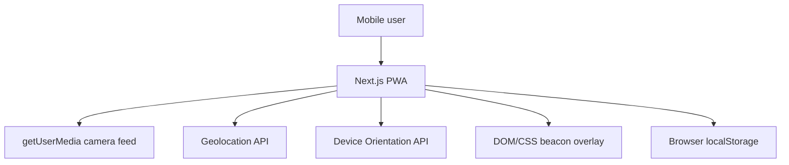

# Technical Specification: Sky Beacon Camera App

Version: 1.1  
Date: 2026-06-10  
Sources: [PRD.md](PRD.md), [SRS.md](SRS.md), [UI.html](UI.html)

## 1. Purpose

Sky Beacon is a mobile-first PWA that lets users preview the real world through their camera and place GPS-backed sky beacons approximately 100 meters ahead of their current position.

The implementation prioritizes a polished, reliable frontend-only MVP that can deploy to Vercel without a separate backend, database, persistent disk, or server process. The app uses browser camera, geolocation, and orientation APIs, renders beacons as a DOM/CSS overlay, and persists saved beacons in browser `localStorage`.

## 2. Locked Technical Decisions

| Area | Decision |
| --- | --- |
| Web framework | Next.js App Router with TypeScript |
| Styling | Tailwind CSS, local UI components, lucide-react |
| Backend | None for MVP |
| Database | None for MVP |
| Auth | None for MVP |
| Beacon persistence | Browser `localStorage`, device-local |
| PWA strategy | Installable PWA with cached app shell |
| Deployment | Standard Vercel Next.js deployment |
| Map | Not included in MVP |
| WebXR | Roadmap only, no MVP dependency |
| Beacon rendering | DOM/CSS overlay above the camera video feed |
| Desktop | Responsive fallback, not the full desktop console |
| Distance display | No precise distance values in the camera overlay |
| Testing | Unit tests, production build validation, and manual Android Chrome device testing |

## 3. Scope

### 3.1 MVP Includes

- Installable mobile-first PWA.
- First-run tutorial before the camera experience.
- Live environment camera feed with desktop fallback.
- Progressive camera, location, and orientation permission prompts.
- Sensor readiness, heading, stability, and confidence UI.
- Preview-and-confirm beacon placement approximately 100 meters ahead.
- Manual beacon color selection from exactly 5 curated colors.
- Up to 3 active saved beacons on the current browser/device.
- Beacon drawer for selecting, renaming, recoloring, deleting, undoing delete, replacing, and clearing beacons.
- Browser-local beacon persistence.
- Directional beacon rendering through the camera overlay based on bearing and heading.
- Off-screen direction indicators.
- Conservative visual obstruction handling by clipping or fading ground-level beacon portions.
- Cached PWA app shell.
- Responsive desktop fallback for development and demos.

### 3.2 MVP Excludes

- Server-hosted accounts or cross-device sync.
- Server-side persistence.
- Map placement or map adjustment.
- WebXR AR anchors.
- Native iOS or Android apps.
- OAuth providers, magic links, or password-based sign-in.
- Offline save queue beyond normal browser-local persistence.
- Social or shared beacons.
- Full desktop console implementation from `UI.html`.
- Precise distance readouts in the camera overlay.

## 4. High-Level Architecture



### 4.1 Runtime Components

- Next.js serves the PWA shell, routes, React components, and static assets.
- Browser APIs provide camera stream, GPS location, device orientation, haptics, and local storage.
- Client-side geospatial utilities calculate destination coordinates, bearings, and overlay positions.
- Beacon service helpers own local record validation, slot management, soft delete, undo, replacement, and persistence.
- The app shell can be cached by a service worker. Beacon storage does not require network access.

### 4.2 Deployment Shape

- Local development: `npm run dev` for desktop testing or `npm run dev:lan` for same-network phone testing.
- Production: deploy to Vercel with the default Next.js install and build settings.
- No runtime environment variables are required for beacon storage.
- Camera, geolocation, service worker, and orientation APIs require HTTPS outside localhost.

## 5. Project Structure

```text
.
├── app/
│   ├── layout.tsx
│   ├── page.tsx
│   ├── globals.css
│   └── manifest.ts
├── components/
│   ├── beacons/
│   │   ├── BeaconDrawer.tsx
│   │   ├── BeaconPillar.tsx
│   │   ├── BeaconOverlay.tsx
│   │   ├── ColorPalette.tsx
│   │   └── OffscreenIndicator.tsx
│   ├── camera/
│   ├── hud/
│   ├── onboarding/
│   ├── ui/
│   └── SkyBeaconApp.tsx
├── lib/
│   ├── beacons/
│   │   ├── beacon-service.ts
│   │   ├── beacon-types.ts
│   │   ├── color-palette.ts
│   │   └── validation.ts
│   ├── geospatial/
│   ├── pwa/
│   ├── sensors/
│   └── utils.ts
├── public/
└── tests/
```

## 6. Beacon Persistence

### 6.1 Storage Key

Beacon records are stored in browser `localStorage` under `sky-beacon:saved-beacons`.

### 6.2 Record Model

```ts
export type BeaconColorId = "cyan" | "amber" | "moss" | "violet" | "rose";
export type BeaconConfidence = "high" | "medium" | "low" | "unknown";
export type BeaconSlot = 1 | 2 | 3;

export interface BeaconRecord {
  id: string;
  slot: BeaconSlot;
  name: string;
  color: BeaconColorId;
  latitude: number;
  longitude: number;
  confidence: BeaconConfidence;
  placementHeading?: number;
  placementDistanceMeters: number;
  locationAccuracyMeters?: number;
  headingAccuracy?: string;
  headingStability?: "stable" | "degraded" | "unstable" | "unknown";
  deletedAt?: string;
  created: string;
  updated: string;
}
```

### 6.3 Persistence Rules

- At most 3 active beacons can exist.
- Slots are numbered 1 through 3.
- New placements use the lowest available active slot.
- Single delete uses `deletedAt` so undo can restore the same record.
- Undo must fail if another active beacon already occupies the deleted record's slot.
- Clear-all soft-deletes the active records and does not expose a bulk undo flow.
- Stored records must be validated while reading; invalid values are ignored instead of crashing the app.

## 7. Frontend Architecture

### 7.1 Routes

| Route | Purpose |
| --- | --- |
| `/` | Main PWA experience: onboarding, camera, HUD, beacons, drawer |
| `/offline` | Cached fallback page if service worker cannot fetch the app shell |

### 7.2 Application States

- `onboarding`: first-run tutorial is active.
- `cameraBlocked`: camera denied, unsupported, or unavailable.
- `cameraReady`: live camera is visible.
- `sensorPending`: location or orientation request is in progress.
- `normal`: camera and HUD are active with no placement preview.
- `preview`: temporary beacon preview is active.
- `saving`: local beacon save or replacement is in progress.
- `drawerOpen`: beacon management drawer is visible.

### 7.3 Main App Responsibilities

`components/SkyBeaconApp.tsx` coordinates:

- Service worker registration.
- Onboarding completion state.
- Camera, location, and orientation hooks.
- Confidence derivation.
- Preview draft creation.
- Local beacon CRUD operations.
- Toasts, drawer state, selected beacon state, and replacement flow.

## 8. Geospatial Model

- Placement starts from the current GPS fix and normalized heading.
- The MVP default placement distance is 100 meters.
- `destinationPoint` calculates beacon latitude/longitude from current position, heading, and distance.
- `bearingBetween` calculates the direction from the user to each saved beacon.
- `mapBearingToOverlayX` maps bearing/heading differences into visible overlay coordinates or off-screen direction indicators.

## 9. PWA Behavior

- The manifest, app icon, and service worker support installability.
- The cached app shell should load without network access once installed.
- Beacon records remain browser-local and are not synced across browsers, devices, or cleared site data.
- The offline route is an app-shell fallback, not a backend outage state.

## 10. Validation

Run before shipping:

```powershell
npm run lint
npm run test
npm run build
```

Manual validation should cover onboarding, camera fallback, permission prompts, preview/confirm placement, drawer editing, delete/undo, replace-at-limit, clear-all, and responsive layout.

## 11. Risks and Assumptions

- Sensor accuracy varies by browser and device; the MVP communicates confidence but cannot guarantee exact physical alignment.
- Device-local storage means users can lose beacons if they clear site data or switch browsers/devices.
- Browser compatibility varies across camera, orientation, compass, haptics, and PWA installation behavior.
- Outdoor usage should account for GPS drift, compass calibration, poor lighting, bright skies, and device performance differences.
- Future account-based sync should be added as a separate backend feature, not as a Vercel deployment prerequisite.
